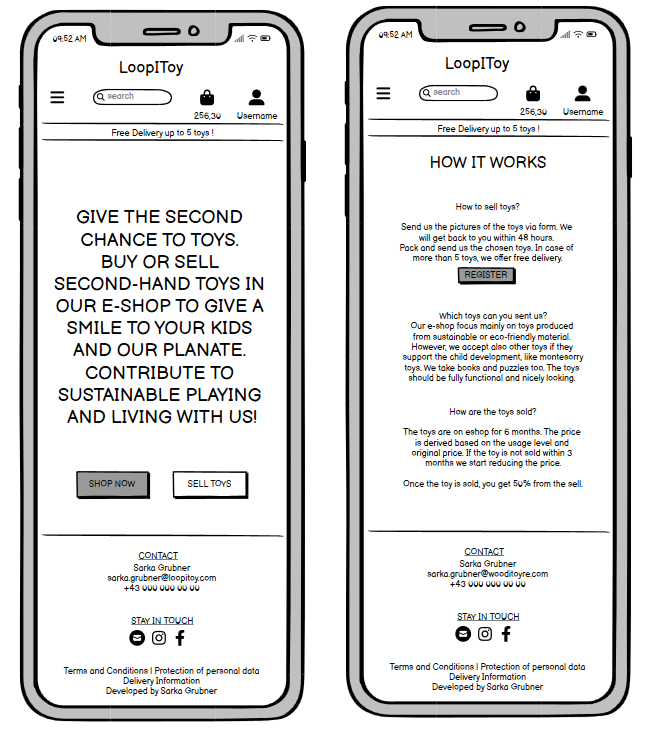
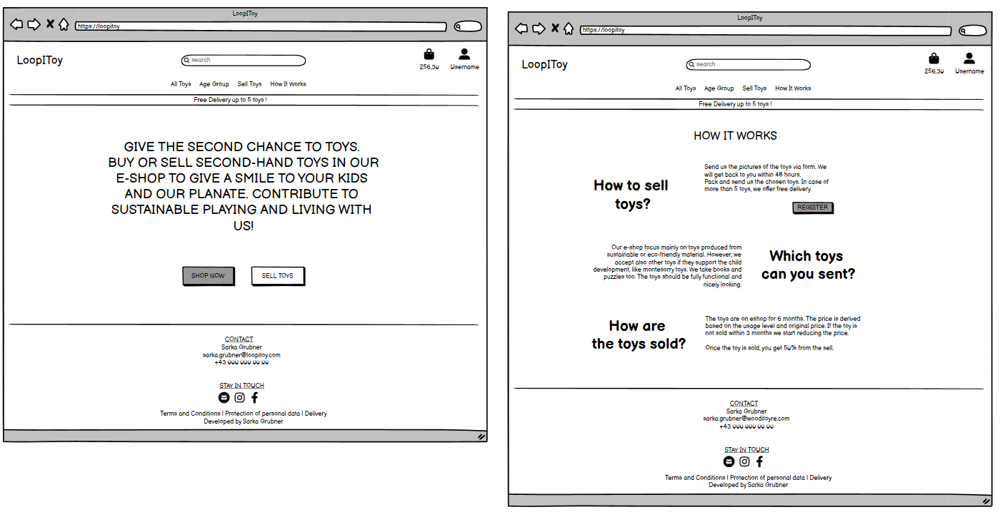
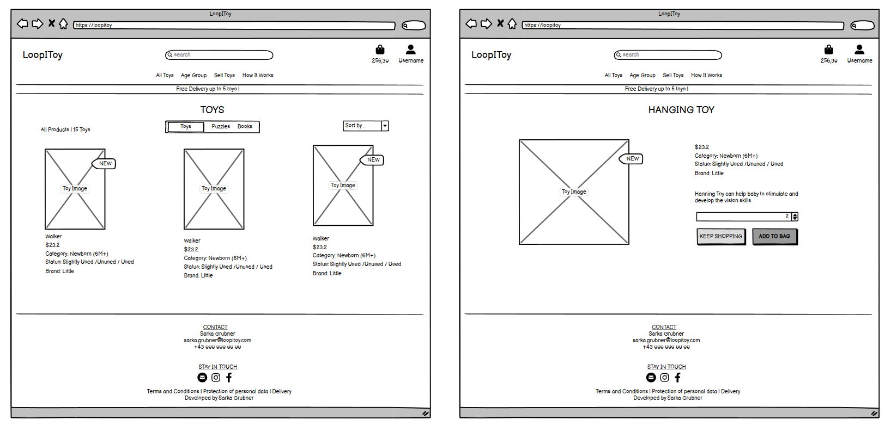
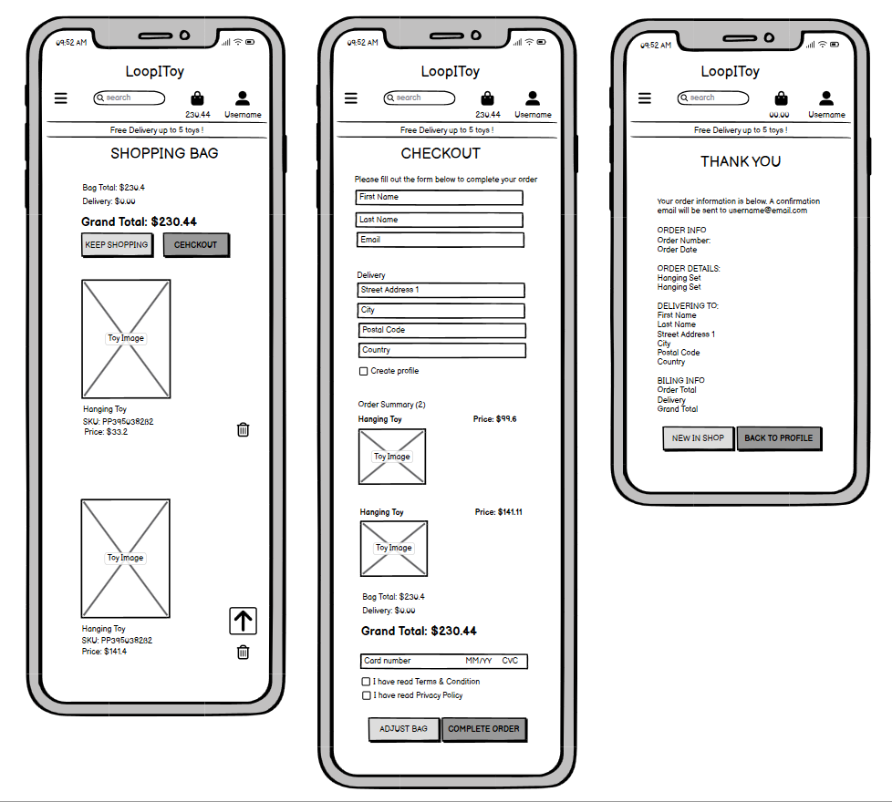
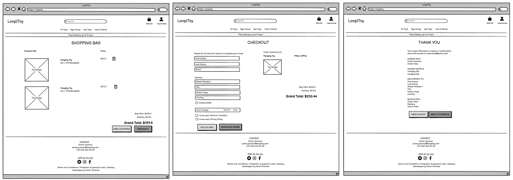
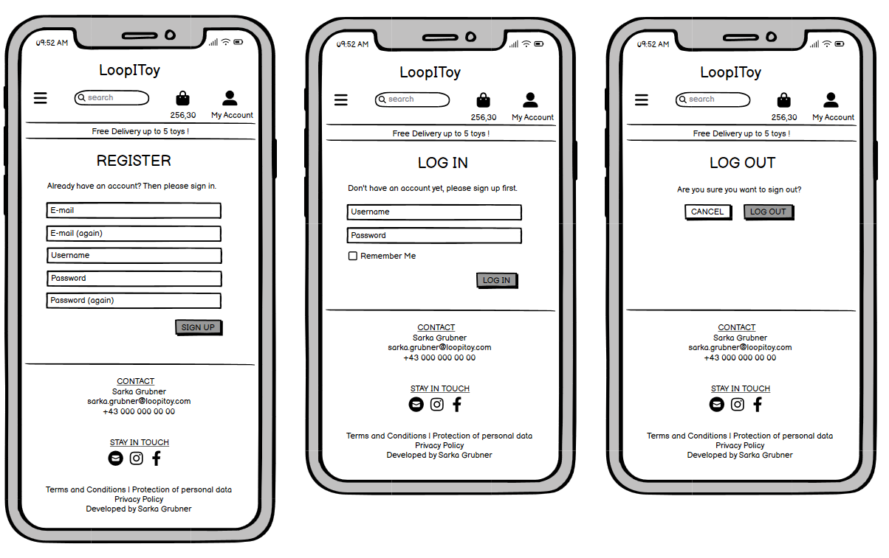
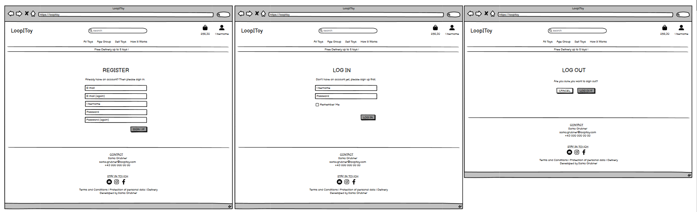
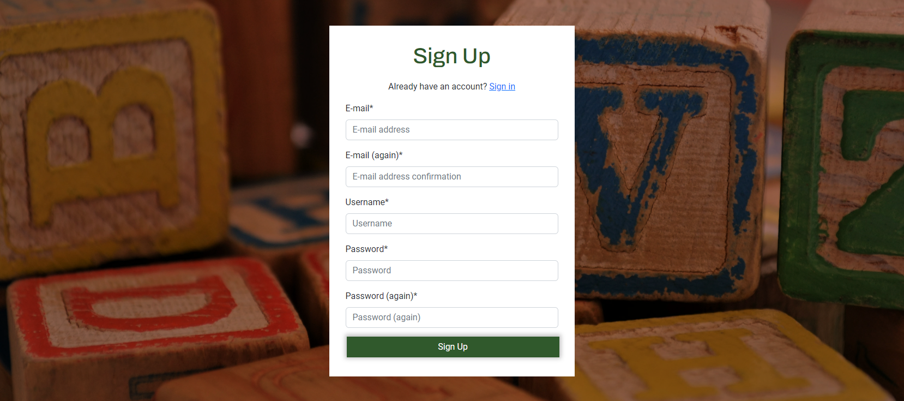
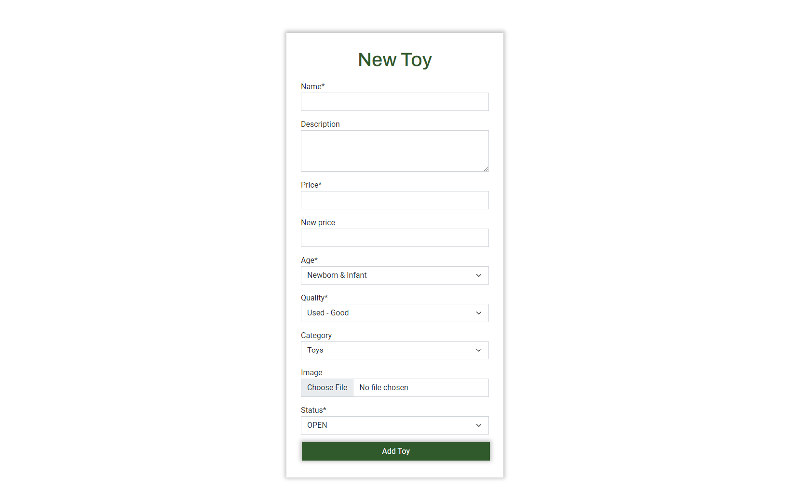
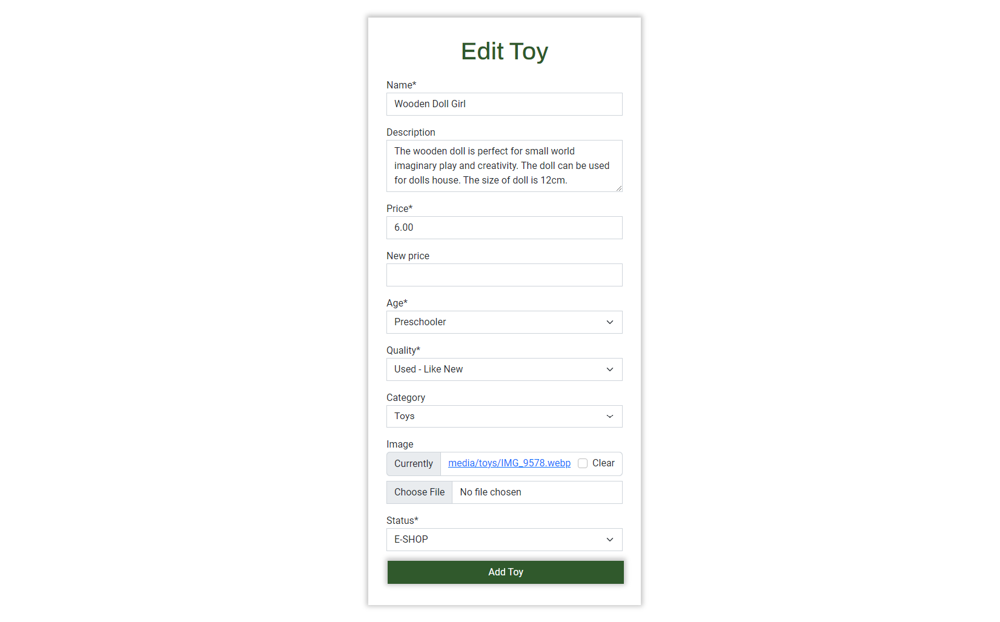

# loopitoy
## UX

### Strategy: User Stories & ERD Model & App Logic Flow

#### User Stories
To plan all features and functionalities of the e-shop, the agile methodology was considered. The core of the methodology is to create epics that are broken down into user stories. Each user story was additionally prioritized using MOSCOW approach. The following epics and user stories were planned:
 
<details>
<summary>EPIC 1: Preperation & Deployment</summary>

- #1: As a developer I want to plan the development of the e-shop so that I can smoothly develop the web page.
- #2: As a developer I want to document the webpage and the development so that the provided solution is transparent and everybody can follow the development.
- #3: As a developer I want to test and validate my webpage so that I can guarantee full functionality and development according to best practice.
- #4: As a developer I wan to deploy the page so that I can guarantee that the web page is accessible to everyone.

</details>

<details>
<summary>EPIC 2: SEO & Marketing</summary>
-todo
</details>


<details>
<summary>EPIC 3: Viewing & Navigation</summary>

- #5: As a first visitor I want to quickly see what the web-page offers so that I can easily purchase or sell toys.
- #9: As a Shopper I want to view a list of all toys so that I can see the whole e-shop offer and select some to purchase.
- #10: As a Shopper I want to view individual toys details so that I can find the price, description, product image and quality.
- #11: As a Shopper I want to quickly identify toys according to age group and toys categories so that I can easily find appropriate toys for my children.
- #12: As a Shopper I want to quickly see the total of my purchases at any time so that I can avoid spending too much time.

</details>


<details>
<summary>EPIC 4: Registration & User Account</summary>

- #13: As a Site User I want to easily register so that I can have a personal account.
- #14: As a Site User I want to easily login and logout so that I can access my account
</details>


<details>
<summary>EPIC 5: Sorting & Searching</summary>
- #20: As a Shopper I want to filter for specific toys categories so that I can easily find and see what I have searched for.
- #21:  As a Shopper I want to search for toys by name or description so that I can find a specific toy I would like to purchase.
- #22: As a Shopper I want to easily add/delete a toy when purchasing it so that I can ensure that I select the correct toy.
</details>

<details>
<summary>EPIC 6: Purchasing & Checkout</summary>
- #23: As a Shopper I want to view my shopping bag so that I can identify the total cost of my purchase and all toys I will receive.
</details>

<details>
<summary>EPIC 7: Selling</summary>
-todo
</details>


<details>
<summary>EPIC 8: Admin & Store Management</summary>

- #33: As a Store Owner I want to add a toy so that I can add new items to my store.
- #34: As a Store Owner I want to update toy details so that I can change the information including toy status.
- #35: As a Site Owner I want to delete a toy so that I can remove toys that are no longer for sale.

</details>

### Scaleton: Wireframes 
Wireframes were prepared for both mobile and desktop devices using balsamiqo program.

| Pages            | Desktop | Mobile | 
|-------------------|--------|------------------|
| Informative Pages |  |  |
| Toys Pages |  |  |
| Purchasing Pages |  |  |
| Authentication Pages |  |  |


### Surface: Fonts & Colors & Images

**Colors**: The final color pallete was selected using [coolors](https://coolors.co/1c304a-b49532-30592c-74301a) online tool to refrect the colors on the landing page and to reflect the favourit children colors. The pallette consist of four colors.  The colors were accessed by [accessible color matrix tool](https://toolness.github.io/accessible-color-matrix/). The accessable combination are depicted in the [accessibility matrix](./docs/ux/us_accessibilityPNG.PNG)

**Font**: Two pairing fonts were chosen base on the [elemnetor blog article](https://elementor.com/blog/font-pairing/). The final fonts are: Archivo Black & Roboto. Both fonts were imported from [Google Fonts](https://fonts.google.com/). 

**Image**: The final image by [Susan Holt Sumpson](https://unsplash.com/@shs521?utm_content=creditCopyText&utm_medium=referral&utm_source=unsplash) on the landing page was chosen on [unsplash]. Two keywords were given: playing children; to get the best suitable image for the second-hand toy e-shop.

## Features
The features of the web page were planned using Agile methodology to ensure Minimum Value Product and to address planned User Stories. The core features of this django-base webpage includes CRUD functionality for both Site Users and Site Owner, so that users can create, read, update and delete records. In additonal, messages are displayed after each CRUD activity.

The sites of e-shop are categorized into severel groups:
- **Landing & Informative Pages** includes Landing and How it Works Pages.
- **Account Pages** includes all sites related to allauth app, i.e. authentication app.
- **Toys Pages** includes all pages related to toy app, e.g. overview of toys, toy detail.
- **Purchasing Pages** includes both Shopping Bag and Checkout Pages. 

The entire web page is also designed to be responsive to ensure that the e-shop is properly displayed on different devices (e.g. a mobile, a desktop). The designed follows commaon best practice of e-shop development. Each site has mutual components, i.e. header with a navigation menu and footer. The mutual components ensure that the user to easily navigates through the content of the e-shop.

## Common Features
- **Header**
    - Header displays navigation menu and buttons. 
    - The navigation buttons includes logo, search field and navigation buttons for profile and shopping bag
    - On small devices the menu drops into a hamburger menu.
    - The content sligthly changes depending on type of user.

- **Footer**
  - Footer is displayed on all pages, except the pages dedicated for user or book registration.
  - Footer contains with social media links, terms and polices, newsletter sugnup link 


## Landing and Informatiove Pages
- **Landing Page** displayes introductory text and two buttons to either proceed to purschase or sell toys.  

- **How It Works Page** outlines the core sell procedure and offers users to register for selling toys. 

## Account Pages
The core authentication pages includes:
- **Login Page** contains a form to log in via username or email into to the platform. Moreover, a user can choose to remember the login data. 
- **Sign Up Page** contains a form to create an account. User have to register using both username and email.
- **Log Out Page** offers user to confirm logging out from the account or stay login. 


## Toy Pages
- **Toys Page** presents all available toys in e-shop. Each toy is depicted in a card element showing the basic information about toy, such as name, price and categories. For Site Owner, there are two buttons in additon: Edit and Remove to edit toy information and delete toy, respectively. 

- **Toy Detail Page** displayes all toy details including buttons to add a toy into shopping bag or to return to all toys. For Site Owner, there are two buttons for adding toy information or toy deletion. 

- **New Toy Page** contains form to fill out in order to create new toy card. This page is only visible for Site Owner. 
- **Edit Toy Page** contains form to edit the toy info. This page is only visible for Site Owner. 
- **Delete Toy Page** contains confirmation to delete the toy from e-shop. This page is only visible for Site Owner. 


## Purchasing Pages
- **Shopping Bag Page** displayed the content of the shopping bag, including toy name with price, total and delivery costs. In addition, there are two buttons to either continue shopping or to proceed checkout. .


### Future & Left Features
- Contact Us with the form and contact informations
- About Us
- Login with Social Media using allauth.cocialaccount and django.contrib.site apps

## Business Model
- project goals
- purpose and value to users and Busnisess
- target audiance - how their needs are addressed by the application
- map project goals to user stories

### SEO
- SEO (keywords, robots.txt, sitemap.xml)

### Marketing
- Social
- Newsletter

## Testing & Validation

### Bugs
- Filter category toys: useing category names to filter out displayed category buttons shows incorect category name. Solution: use pk of categories to filter out the displayed category. SOLVED

## Technologies Used
[Accessible color palette builder](https://toolness.github.io/accessible-color-matrix/)
[Webp Converer](https://ezgif.com/png-to-webp?err=expired)

## Deployment & Forking & Cloning
[Visual Studio Code](https://code.visualstudio.com/) and [GitHub](https://github.com/) have been used to build the web page. Make sure you have them installed.

### Setup the workspace

The workspace should be setup as follows:
1. Open the terminal in Visual Studio Code (Navigation Menu > Terminal > New Terminal)
2. Navigate to the location, where you would like to have the repository locally
3. Clone the repository `git clone https://code.visualstudio.com/`. Once the repository is successfully cloned, the repo folder is created.
4. Open VS from the repo folder. In order to setup your virtual environment, [pyenv](https://github.com/pyenv/pyenv) and [venv](https://docs.python.org/3/library/venv.html) must be installed. setup the loval environment. Run ```python -m venv venv``` to create virtual environment and `pyenv local 3.12.0` to install python version for this application.
5. Use `.\venv\Scripts\activate` to active the virtual environment.
6. Install the dependencies from the `requirements.txt` file `pip install -r requirements.txt`
7. Set up the database key for ElephantSQL Database, see [Setup Database](#setup-database)
8. Create `env.py` file to specify environment variables     
    - `SECRET_KEY` move the django secret key from `settings.py`
    - `DATABASE_URL` assign the generated database key
    - `os.environ["DEV"] = "True"`
    - `os.environ["DEBUG"] = "True"`
9. Build the logic to use the ElphantSQL Database in production environment (i.e. on Heroku) and the local sqlite database when developing the application.


### Setup Production Database

1. Login to [ElephantSQL](https://customer.elephantsql.com/instance), you see all created database instances.
2. Click on the green button 'Create New Instance' at the rigt top corner.
3. Fill out the form. Specify database name > Select Region > Leave the data center default > Review > Create Instance.
4. You will be redirected to the overview off all instaces, click on the created database instance to see details about database.
5. Copy the URL and assign it to the environment variable `DATABASE_URL` in `env.py`

### Setup Production Environment on Heroku

1. Login to [Heroku](https://dashboard.heroku.com/apps).
2. Go to Heroku personal Dashboard. At the left top corner, select 'New' > 'Create New App'
3. Type a unique project name, i.e. loopitoy. Select a region, i.e. Europe.
4. After the Heroku app is created, navigate to the 'Settings' Tab > 'Config Vars'. Following variables were configured: `SECRET_KEY, DATABASE_URL, PORT`
4. After the Heroku app is created, go to the Deploy Tab of the app and connect the app with app GitHub repository.
5. Switch your database on local environment to production database, i.e delete `DEV` from `env.py`.
5. Make initial migrations, create super user and load the city data set in production database.
7. Create a Procfile file with the command to migrate automatically for Heroku and to start the web app.
5. Deploy the app manually. After successful deployment, click on 'Enable automatic deployments'.

### Setup AWS S3
The AWS S3 Bucket was used to host the static files. The setup procedure includes setting up S3 Bucket and IAM Identity. Both procedures are describe below in more details:

<details>
<summary> Setup S3 Bucket</summary>

1. Login to AWS Management Console.
2. Find S3 Bucket Servis in the list of servises
3. Click on Crete New Bucket Button at the top right corner.
4. Set up the general configuration as follows
    - Give the name to your bucket, e.g. loopitoy
    - Object Ownership: Choose ACLs enabled > Choose Bucket owner preferred 
    - Block Public Asses: Unchecked Block all public acces > Check 'I acknowledge that the current settings might result in this bucket and the objects within becoming public.'
    - Click on Create Bucket
5. You see the created bucket in the list of your buckets.
6. Set up Bucket Setting as follows
    - Click on the created bucket in the list.
    - Click on the Properties Tab
    - Scroll down and go to Static website hosting Section: Click on Edit > Chose Enable > Fill out index.html and error.html > Click on Save changes
7. Set up Permission as follows
    - Click on the Permission Tab
    - Scroll down and Click on Cross-orgin resource sharing (CORS) Section: Click on Edit > Paste the configuration > Click on Save changes
    - Go to Bucket Police Section: Click on Edit > Click on Policy Generator (Select Type of Policy: S3 Bucket Policy, Effect: Allow, Principal: *, AWS Servis: Amazon S3, Actions: GetObject, ARN: copy ARN from the Bucket Policy Section ) > Click on Add Statement > Click on Generate Policy > Copy the policy > Pase the policy in the Bucket Policy Section > Add "/**" in the end of the Resource > CLick on Save changes
    - Go to Access control list (ACL) Section: Check the List for Everyone (public access) > Save Changes

</details>


<details>
<summary> Setup IAM </summary>

1. Find IAM Identity and Access Management in the list of servises.
3. Create a Group:
    - Select User groups on the sidebar menu
    - Click on Create Group
    - Give the name to user group, e.g. manage-loopitoy
    - Click on Create Group
4. Create Policy 
    - Select Policy on the sidebar menu
    - Click on Create Policy > Select JSON
    - Go to Actions > Select Import Policy > AmozonS3FullAccess > Click on Import policy > Copy the ARN Code from the Bucket into the Resource list, i.e. `["arn","arn/*"]` > Click on Next > Give it name, i.e. loopitoy-policy > Add Description > Click on Create Policy
4. Attached the Policy to the User Group
    - Select User groups on the sidebar menu
    - Select the created User group, i.e. manage-loopitoy
    - Go to Permission Tab > Click on Add Permission > Select Attach Policy > Select created policy, i.e. loopitoy-policy > Click on Attach Policy
5. Create a User
    - Select User on the sidebar menu
    - Click on Create User
    - Give it name, i.e. loopitoy-staticfiles-user > Click on Next > Select the User Group, i.e. manage-loopitoy, > Next > Click on Create User
6. Generate Access Key from the selected user, i.e. lopitoy-staticfiles-user

</details>

### Setup Stripe & Webhook


### Forking

### Cloning


### Credits & Inspiration
- [Django Tutorial](https://www.youtube.com/playlist?list=PLXuTq6OsqZjbCSfiLNb2f1FOs8viArjWy) by Daisy McGeer
- [Butique Ado](https://github.com/ckz8780/boutique_ado_v1) by CI and all study material provided by CI
- [Stack Overflow: Overwrite Save](https://stackoverflow.com/questions/69365764/django-i-want-to-create-a-self-generated-code-based-on-previous-records-and-a-s)
- [Privacy Policy Generator](https://termify.io/dashboard/)