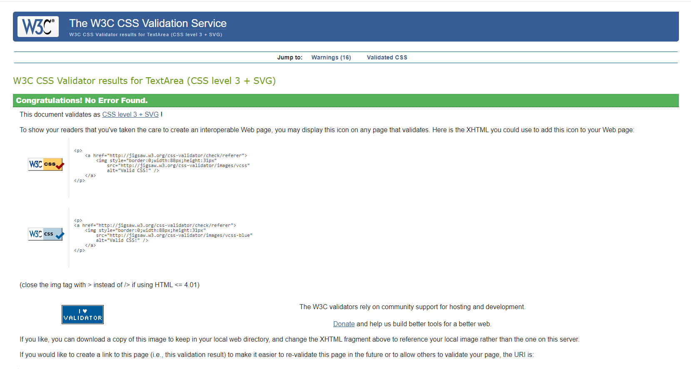
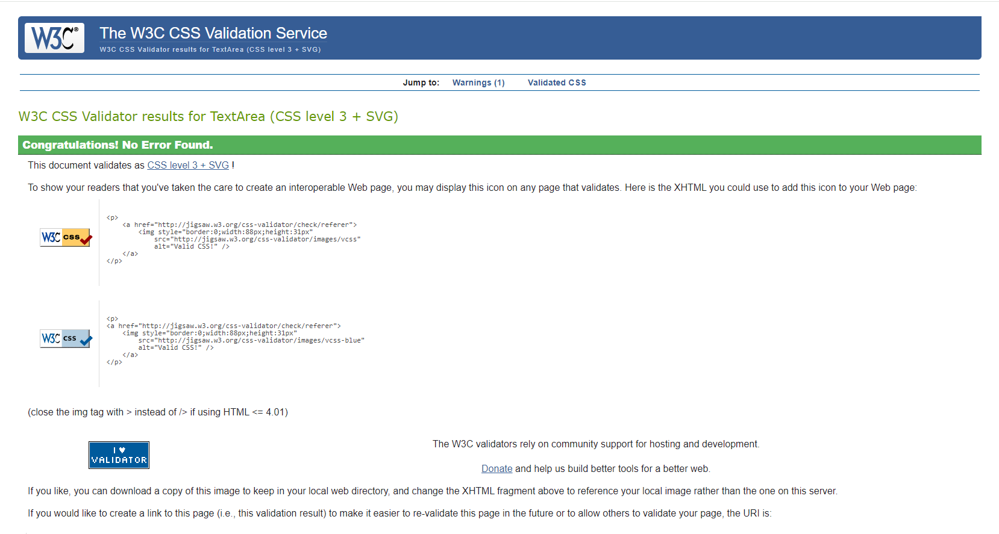

# Testing & Validation 
 
  - [Responsivness Testing](#responsivness-testing)
  - [Browser Compatibility Testing](#browser-compatibility-testing)
  - [User Stories Testing](#user-stories-testing)
  - [Features Testing (Manual Testing)](#feature-testing)
  - [Code Validation](#code-validation)
  - [Lighthouse Testing](#lighthouse)

## Responsiveness Testing
All pages were tested in terms of responsivness to ensure that the conent reacts on various screen size, ranging from 280px up to 1200px. To test the responsiveness the following devices were considered in addition to DevTools.
  - Dell Latitude (DevTool) 
  - iPhone 8 (iOS 16.5)
  - Samsung Galaxy A52

[Back to the content](#testing--validation)

## Browser Compatibility Testing
The website was tested on different browser (see the list below) to assure that features and responsiveness work accordingly.
- Safari
- Chrome
- Firefox
- Edge

## User Stories Testing
The testing was grouped according to the epics to which user story belongs.

[Back to the content](#testing--validation-report)

## Features Testing
The features testing was also conducted group-wise. The outcome and testing steps are described bellow in detail.

### Testing Webhooks using Stripe CLI
- Follow [official documentation](https://docs.stripe.com/stripe-cli) to setup Stripe CLI.
- Open PowerShell and use command `stripe login` to log in to your stripe account.
- To forward events to your webhook, type `stripe listen --forward to localhost:4242/webhook`
- Test different type of events, e.g. using `stripe trigger payment_intent.succeeded`, more type events can be found [here](https://dashboard.stripe.com/test/webhooks/create?endpoint_location=local). 

**Report**
The Webhook was tested on both development and production environment. Two type of events were tested: `payment_intent.succeeded` and `payment_intent.payment_failed`. The outcome of testing is listed below
- Development
    - `payment_intent.payment_failed`: [terminal](./docs/testing/wh/wh_payment_failed_terminal.PNG), [dashboard](./docs/testing/wh/wh_payment_failed_dashboard.PNG)
    - `payment_intent.succeeded` : [terminal](./docs/testing/wh/wh_payment_successed_terminal.PNG), [dashboard](./docs/testing/wh/wh_payment_successed_dashboard.PNG), [cache data](./docs/testing/wh/cacha_data.PNG)
- Production
 - `payment_intent.payment_failed`:
 - `payment_intent.succeeded` :

There were additional webhook test performed, see the report of Features Testing, TODO: 

## Code Validation
The webpage was validated from several perspectives:
- the markup validity, see [HTML](#html).
- the css properties, see [CSS](#css).
- the web accessibility, see [Accessibility](#accessibility).
- the coding rules of the JavaScript source code, see [JavaScript](#javascript).
- the coding rules of Python source code, see [Python](#pep8).
- the more general quality of the webpage, see [Lighthouse](#lighthouse)

### HTML 
The [Nu Html Checker](https://validator.w3.org/nu/) web-based tool by W3 was used to validate the pages of the webpage. **The Checker did not reveal any errors.** The source code of pages requiring login was checked directly via text input. Other pages were tested via provided page URL. The detailed reports for each page are below:

| Page Group | Page | Report | Results |
|------------|------|--------|---------|
| Viewing & Navigation | Landing Page | [On-line Report](https://validator.w3.org/nu/?doc=https%3A%2F%2Floopitoy-2943fdc3b2bc.herokuapp.com%2F) | no errors |
|  | How it Works| [On-line Report](https://validator.w3.org/nu/?doc=https%3A%2F%2Floopitoy-2943fdc3b2bc.herokuapp.com%2Fhow-it-works) | no errors |
|  | Contact | [Online Report](https://validator.w3.org/nu/?doc=https%3A%2F%2Floopitoy-2943fdc3b2bc.herokuapp.com%2Fcontact%2F) |
| Toys | Toys Overview | [On-line Report](https://validator.w3.org/nu/?doc=https%3A%2F%2Floopitoy-2943fdc3b2bc.herokuapp.com%2Ftoys%2F) | no errors|
|  | Toy Detail | [On-line Report](https://validator.w3.org/nu/?doc=https%3A%2F%2Floopitoy-2943fdc3b2bc.herokuapp.com%2Ftoys%2Fdetail%2F6%2F) | no errors|
|  | Toy Filter | [On-line Report](https://validator.w3.org/nu/?doc=https%3A%2F%2Floopitoy-2943fdc3b2bc.herokuapp.com%2Ftoys%2F%3Fcategory%3Dfine_motor%2Cgross_motor) | no errors|
| | Toy Search | [On-line Report](https://validator.w3.org/nu/?doc=https%3A%2F%2Floopitoy-2943fdc3b2bc.herokuapp.com%2Ftoys%2F%3Fq%3Dwood) | no errors|
| Account | Log In | [On-line Report](https://loopitoy-2943fdc3b2bc.herokuapp.com/accounts/login/) | no erros |
|  | Log Out | [On-line Report](https://validator.w3.org/nu/?doc=https%3A%2F%2Floopitoy-2943fdc3b2bc.herokuapp.com%2Faccounts%2Flogout%2F) | no erros |
|  | Sign Up | [On-line Report](https://loopitoy-2943fdc3b2bc.herokuapp.com/accounts/signup/) | no erros 
| Admin & Site Owner | Add Toy | [Report](./docs/testing/html/html_admin_add_toy.PNG) | no erros |
| | Edit Toy | [Report](./docs/testing/html/html_admin_edit_toy.PNG) | no erros |
| | Delete Toy | [Report](./docs/testing/html/html_admin_delete_toy.PNG) | no erros |
| Purchasing & Checkout| Shopping Bag | [Report](./docs/testing/html/html_bag.PNG) | no erros |
| Checkout | [Report](./docs/testing/html/html_checkout.PNG) | no erros |
| Checkout - Thank you| [Report](./docs/testing/html/html_checkout_thank_you.PNG) | no erros |
| Profile | [Report](./docs/testing/html/html_profile.PNG) | no erros |

### Javascript
The [JShint](https://jshint.com/) static tool was considered to check the code rules of the Javascript source code.

### CSS
The [jigsaw](https://jigsaw.w3.org/css-validator/) web-based tool by W3 was used to validate the CSS of the webpage. The conent of `base.css` and `checkout.css` was directly insertet on [the webpage](https://jigsaw.w3.org/css-validator/#validate_by_input). The CSS Validator did not detect any erros, see reports bellow.

| CSS File | Report | Results   |
|----------|--------|-----------|
| `base.css` |  | no error |
| `checkout.css` |  | no error |

### PEP8
To validate the Python code in terms of PEP8, the [CI Python Linter](https://pep8ci.herokuapp.com/#) was used.

| Module | Python file               | Report | Results   |
|--------|---------------------------|--------|-----------|
|`findmereadme` | `urls.py`          |  | no error |

### Accessibility
The [WAVE](https://wave.webaim.org/) web-based tool was considered for the evaluation of the web accessibility. For the pages required authentication chrome extension [WAVE Evaluation Tool](https://chromewebstore.google.com/detail/wave-evaluation-tool/jbbplnpkjmmeebjpijfedlgcdilocofh) was used. In generally, the validation did not reveal any errors. Two alerts were noticed. A redundant link in navigation as there is a link to homepage attached to both logo and home. The home item and link was removed from the navigation menu. Second alert is related to the PDF link. To increase the accessibility an `arial-label` attribute is present. The detailed reports are below:

| Category | Page Report | Results |
|----------|-------------|---------|
| Homepage | [Home](https://wave.webaim.org/report#/https://findme-readme-10d0bfb3ba28.herokuapp.com/) | no errors

## Lighthouse
The Lighthouse in Chrome DevTools evaluates the webpage for performance, accessibility, best practices, and SEO. The pages with the main content were evaluated, meaning the pages with forms were not considered as they are produce mainly form The evaluation did not reveal any big issues. The detailed reports can be viewed at:

| Page            | Desktop | Mobile | 
|-------------------|--------|------------------|
| Home |  |  |

[Back to the content](#testing--validation-report)