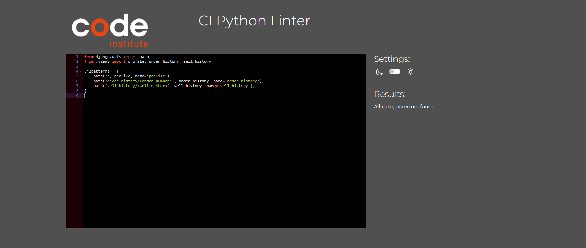

# Testing & Validation 
 
  - [Responsivness Testing](#responsivness-testing)
  - [Browser Compatibility Testing](#browser-compatibility-testing)
  - [User Stories Testing](#user-stories-testing)
  - [Features Testing (Manual Testing)](#feature-testing)
  - [Code Validation](#code-validation)
  - [Lighthouse Testing](#lighthouse)

## Responsiveness Testing
All pages were tested in terms of responsivness to ensure that the conent reacts on various screen size, ranging from 280px up to 1200px. To test the responsiveness the following devices were considered in addition to DevTools.
  - Dell Latitude (DevTool) 
  - iPhone 8 (iOS 16.5)
  - Samsung Galaxy A52

[Back to the content](#testing--validation)

## Browser Compatibility Testing
The website was tested on different browser (see the list below) to assure that features and responsiveness work accordingly.
- Safari
- Chrome
- Firefox
- Edge

## User Stories Testing
The testing was grouped according to the epics to which user story belongs.

[Back to the content](#testing--validation-report)

## Features Testing
The features testing was also conducted group-wise. The outcome and testing steps are described bellow in detail.

| ID  | Test Case                                 | Steps                                                                                                                                                                                                     | Expected                                                                                                                                                                                                                                                                                               | Result |
| --- | ----------------------------------------- | --------------------------------------------------------------------------------------------------------------------------------------------------------------------------------------------------------- | ------------------------------------------------------------------------------------------------------------------------------------------------------------------------------------------------------------------------------------------------------------------------------------------------------ | ------ |
| F1  | Navigation Items                          | Go to My Profile > Click on Register Go to My Account > Click on Login Login > Go to My Profile > Click on Logout Go to How it Works Go to Toys > All Products Go to My Profile            | Form to register is displayed Form to Login is displayed Question to Logout or Stay is displayed User is redirected to How It Works Page User is redirected to page with all toys User is redirected to My Profile Page                                                                 | PASS   |
| F2  | Navigation Items Hover effect             | Go each item in navigation menu and check the hove effect                                                                                                                                                 | Each item should change the font weight to bold                                                                                                                                                                                                                                                        | PASS   |
| F3  | Footer - Social Links                     | Go to Footer Click on Facebook Icon Click on Instagram Icon Click on Email Icon                                                                                                                  | The corresponding social media platform is open in a new tab. The Email Editor is open to contact e-shop.                                                                                                                                                                                           | PASS   |
| F4  | Footer - Polices & Terms                  | Go to Footer Click on Privacy Policy Click on Return & Refund Click on Terms & Conditions                                                                                                        | The user is redirected to the corresponding page.                                                                                                                                                                                                                                                      | PASS   |
| F5  | Register                                  | Go to My Account Click on Register Register with test user Confirm the registration in email                                                                                                     | Toast message is displayed to inform about registering and sending email Email to confirm registration is received.                                                                                                                                                                                 |        |
| F6  | Log in                                    | Go to My Profile Click on Log In Log in with test user                                                                                                                                              | Test user is logged in and the user name is displayed unter the user icon. Toast message about logging in is displayed                                                                                                                                                                              | PASS   |
| F7  | Log out                                   | Login with test user Go to My Account > Click on Log Out Click on Stay Button Go to My Account > Click on Logout Click on Logout Button                                                       | Question is display whether to stay or log out When clicked on Stay, user is redirected to the homepage When clicked on Log out, user is logged out Toast message informarming about logging out is displayed.                                                                                | PASS   |
| F8  | Reset Password                            | Go to My Account > Login > Forget my password Enter the email address Wait for email > Click on Link to change password Enter new password                                                       | Email with the link to reset password is received After entering a new password and message is shown that the password was reset.                                                                                                                                                                   | PASS   |
| F9  |  Add Toy - Required field                 | Go to My Account Log in as Site Owner Click on My Account > Add New Toy Fill out form leaving on required field empty                                                                            | User is redirected to the New Toy form. User is ask to fill out the required form.                                                                                                                                                                                                                  | PASS   |
| F10 | Add Toy                                   | Continue from previous Fill out form correctly                                                                                                                                                         | User is redirected to the Toys Page. Toast message is displayed                                                                                                                                                                                                                                     | PASS   |
| F11 | Edit Toy - Button                         | Go to My Account Log in as Site Owner Go to the Toys Page Click on Edit in one of the toys                                                                                                       | User is redirected to the Edit Toy form                                                                                                                                                                                                                                                                | PASS   |
| F12 | Edit Toy                                  | Continue from previous Update one of the form field.                                                                                                                                                   | User is redirected to the Toys Page. Toast message is displayed.                                                                                                                                                                                                                                    | PASS   |
| F13 | Delete Toy - Button                       | Go to My Account Log in as Site Owner Go to the Toys Page Click on Delete in one of the toys                                                                                                     | User is redirected to the Delete Toy Question with two Buttons                                                                                                                                                                                                                                         | PASS   |
| F14 | Delete Toy - Back                         | Continue form previous Click on Back                                                                                                                                                                   | User is redirected to the Toys Page                                                                                                                                                                                                                                                                    | PASS   |
| F15 | Delete Toy - Delete                       | Continue from 'Delete Toy - Button Click on Delete                                                                                                                                                     | Toy is deleted User is redirected to the Toys Page. Toast message is displayed                                                                                                                                                                                                                   | PASS   |
| F16 | Search - Name                             | Click on Search Input Field Search for Train Click on Clear Search                                                                                                                                  | Results for train should be displayed the number of search results is displayed Button to clear Search is displayed User is redirected to all toys and the button disappears                                                                                                                  | PASS   |
| F17 | Search - Description                      | Click on Search Input Field Search for Play Click on Clear Search                                                                                                                                   | Results for train should be displayed the number of search results is displayed Button to clear Search is displayed User is redirected to all toys and the button disappears                                                                                                                  | PASS   |
| F18 | Filter - Toy Category                     | Click on Toy Category Select one toy category Click on one subcategory                                                                                                                              | The number of toys corresponding to the category and toys are displayed The subcategories of the category are show The number of toys and target toys are displayed                                                                                                                           | PASS   |
| F19 | Filter - Age Group                        | Click on Age Group Select one age group Click on one subcategory if present                                                                                                                         | The number of toys corresponding to the age group and toys are displayed The subcategories of the age group are show The number of toys and target toys are displayed                                                                                                                         | PASS   |
| F20 | Shopping Bag - Icon                       | Add some toys into shopping bag Look at the bag icon in navigation menu                                                                                                                                | The icon is colored differently There is total cost of shopping bag below the icon Toast message with the bag content and checkout button is displayed                                                                                                                                           | PASS   |
| F21 | Shopping Bag                              | Continue from the previous Click on bag icon in navigation menu                                                                                                                                        | There is a list of inserted toys with corresponding prices Information about cost is displayed Two buttons Back and Checkout are shown                                                                                                                                                           | PASS   |
| F22 | Shopping Bag - Delete                     | Continue from the previous Click on the Trash button next to one of the inserted toy                                                                                                                   | The toy is removed from the shopping bag User is informed in toast message about the action                                                                                                                                                                                                         | PASS   |
| F23 | Shopping Bag - Back                       | Continue form the previous Shopping Bag Click on Back Button                                                                                                                                           | User is redirected to the page with all toys                                                                                                                                                                                                                                                           | PASS   |
| F24 | Shopping Bag - Checkout                   | Continue from the previous Shopping Bag Leave the Check Box Save Delivery info checked Click on Checkout Button                                                                                     | User is redirected to the Checkout page                                                                                                                                                                                                                                                                | PASS   |
| F25 | Checkout - Form                           | Continue from the previous Shopping Bag - Checkout Fill out the form but leave one required field empty Click on Complete Order                                                                     | User is informed about not filled out field that is required                                                                                                                                                                                                                                           | PASS   |
| F26 | Checkout - Complete                       | Continue from the previous Shopping Bag - Checkout Fill out the form correctly, with the bank details 4242 4242 4242 4242 Click on Complete Order                                                   | User is redirected on the Thank you page with the order summary. User is informed by toast message about the success.                                                                                                                                                                               | PASS   |
| F27 | Checkout - Authentication ( Failed)       | Continue from the previous Shopping Bag - Checkout Fill out the form with the bank details: 4000 0025 0000 3155 Click on Complete Order Authenticate                                             | Authentication Page is shown. User is redirected to the Checkout page.                                                                                                                                                                                                                              | PASS   |
| F28 | Checkout - Authentication (Complete)      | Continue from the previous Shopping Bag - Checkout Fill out the form with the bank details: 4000 0025 0000 3155 Click on Complete Order Cancel                                                   | Authentication Page is displayed. User is redirected on the Thank you page with the order summary. User is informed by toast message about the success.                                                                                                                                          | PASS   |
| F29 | Checkout - Save Delivery Info (checked)   | Continue from the previous Shopping Bag - Checkout Go to My Account > My Profile                                                                                                                       | The delivery info is saved                                                                                                                                                                                                                                                                             | PASS   |
| F30 | Checkout - Save Delivery Info (unchecked) | Continue from the previous Shopping Bag Give different delivery information Unchecked the Check Box to Save Delivery Information Go to My Account > My Profile                                   | The delivery info did not changed from the previously inserted.                                                                                                                                                                                                                                        | PASS   |
| F31 | Webhook - Succeed                         | Add some toys into shopping bag and fill out checkout with test card Go to Stripe > Developers > Webhooks Check the status and response of the event                                                | User is redirected to the Checkout Thank you Page containing delivery and billing info Toast message informs user about completing the order and sending confirmation email Email is received with the order details Webooh dashboard: Response - SUCCESS: Verified order already in database | PASS   |
| F32 | Webhook - Form is not sended              | Comment form.submit() in stripe_elemetns.js Add some toys into shopping bag and fill out checkout with test card Go to Stripe > Developers > Webhooks Check the status and response of the event | the loading spinner should stay Webooh dashboard: Response - SUCCESS: Created order in webhook The profile is attached                                                                                                                                                                           | PASS   |
| F33 | Profile - Order                           | Go to My Account > Login Go to My Profile > Click on a order listed in Order History                                                                                                                   | User is redirected to the Order Details Page                                                                                                                                                                                                                                                           | PASS   |
| F34 | Profile - See older orders                | Go to My Account > Login Go to My Profile > Click on a order listed in See older orders                                                                                                                | User is redirected to the Order History Page                                                                                                                                                                                                                                                           | PASS   |
| F35 | Profile - Sell                            | Go to My Account > Login Go to My Profile > Click on a order listed in Sell History                                                                                                                    | User is redirected to the Sell Details Page                                                                                                                                                                                                                                                            | PASS   |
| F36 | Profile - See older sells                 | Go to My Account > Login Go to My Profile > Click on a order listed in See older sells                                                                                                                 | User is redirected to the Sell History Page                                                                                                                                                                                                                                                            | PASS   |
| F37 | Profile - Form                            | Go to My Account > Login Go to My Profile > Fill out the Form Click on Save Information Button                                                                                                      | The filled out information are saved/updated in the form. User is informed via toast message about the updated profile information                                                                                                                                                                  | PASS   |
| F38 | Contact                                   | Click on Contact in navigation Menu Fill out the form Click on Send                                                                                                                                 | The thank you page is displayed with the home button                                                                                                                                                                                                                                                   | PASS   |
| F39 | Contact - Missing field                   | Click on Contact in navigation Menu Fill out the form but leaving one empty field Click on Send button                                                                                              | User is informed about not filled out field that is required                                                                                                                                                                                                                                           | PASS   |
| F40 | Thank You Page                            | Continue from Contact Click on Home Button                                                                                                                                                             | User is redirected to the landing page                                                                                                                                                                                                                                                                 | PASS   |
| F41 | Newsletter                                | Scroll down to footer on any but landing page Fill out email for subscription                                                                                                                          | Message is show that email was saved for subscription                                                                                                                                                                                                                                                  | PASS   |
| F42 | Hidden Page - 404                         | Extend the url and add /test in the end                                                                                                                                                                   | 404 Page is shown                                                                                                                                                                                                                                                                                      | PASS   |
| F43 | Hidden Page - 403                         | Login as admin Extend the url and add /toys/add                                                                                                                                                        | 403 Page is shon                                                                                                                                                                                                                                                                                       | PASS   |

[Back to the content](#testing--validation)

### Testing Webhooks using Stripe CLI
- Follow [official documentation](https://docs.stripe.com/stripe-cli) to setup Stripe CLI.
- Open PowerShell and use command `stripe login` to log in to your stripe account.
- To forward events to your webhook, type `stripe listen --forward to localhost:4242/webhook`
- Test different type of events, e.g. using `stripe trigger payment_intent.succeeded`, more type events can be found [here](https://dashboard.stripe.com/test/webhooks/create?endpoint_location=local). 

**Report**
The Webhook was tested on development environment. Two type of events were tested: `payment_intent.succeeded` and `payment_intent.payment_failed`. The outcome of testing is listed below
  - `payment_intent.payment_failed`: [terminal](./docs/testing/wh/wh_payment_failed_terminal.PNG), [dashboard](./docs/testing/wh/wh_payment_failed_dashboard.PNG)
  - `payment_intent.succeeded` : [terminal](./docs/testing/wh/wh_payment_successed_terminal.PNG), [dashboard](./docs/testing/wh/wh_payment_successed_dashboard.PNG), [cache data](./docs/testing/wh/cacha_data.PNG)

There were additional webhook test performed, see the report of Features Testing 

## Code Validation
The webpage was validated from several perspectives:
- the markup validity, see [HTML](#html).
- the css properties, see [CSS](#css).
- the web accessibility, see [Accessibility](#accessibility).
- the coding rules of the JavaScript source code, see [JavaScript](#javascript).
- the coding rules of Python source code, see [Python](#pep8).
- the more general quality of the webpage, see [Lighthouse](#lighthouse)

### HTML 
The [Nu Html Checker](https://validator.w3.org/nu/) web-based tool by W3 was used to validate the pages of the webpage. **The Checker did not reveal any errors.** The source code of pages requiring login was checked directly via text input. Other pages were tested via provided page URL. The validation detected several errors in the snippet code to Subscribe. This code was copied directly from [mailchimp](https://us14.admin.mailchimp.com/). The below detailed reports ignore the errors from mailchimp tool:

| Page Group | Page | Report | Results |
|------------|------|--------|---------|
| Viewing & Navigation | Landing Page | [On-line Report](https://validator.w3.org/nu/?doc=https%3A%2F%2Floopitoy-2943fdc3b2bc.herokuapp.com%2F) | no errors |
|  | How it Works| [On-line Report](https://validator.w3.org/nu/?doc=https%3A%2F%2Floopitoy-2943fdc3b2bc.herokuapp.com%2Fhow-it-works) | no errors |
|  | Contact | [Online Report](https://validator.w3.org/nu/?doc=https%3A%2F%2Floopitoy-2943fdc3b2bc.herokuapp.com%2Fcontact%2F) | no errors |
| Toys | Toys Overview | [On-line Report](https://validator.w3.org/nu/?doc=https%3A%2F%2Floopitoy-2943fdc3b2bc.herokuapp.com%2Ftoys%2F) | no errors|
|  | Toy Detail | [On-line Report](https://validator.w3.org/nu/?doc=https%3A%2F%2Floopitoy-2943fdc3b2bc.herokuapp.com%2Ftoys%2Fdetail%2F6%2F) | no errors|
|  | Toy Filter | [On-line Report](https://validator.w3.org/nu/?doc=https%3A%2F%2Floopitoy-2943fdc3b2bc.herokuapp.com%2Ftoys%2F%3Fcategory%3Dfine_motor%2Cgross_motor) | no errors|
| | Toy Search | [On-line Report](https://validator.w3.org/nu/?doc=https%3A%2F%2Floopitoy-2943fdc3b2bc.herokuapp.com%2Ftoys%2F%3Fq%3Dwood) | no errors|
| Account | Log In | [On-line Report](https://loopitoy-2943fdc3b2bc.herokuapp.com/accounts/login/) | no erros |
|  | Log Out | [On-line Report](https://validator.w3.org/nu/?doc=https%3A%2F%2Floopitoy-2943fdc3b2bc.herokuapp.com%2Faccounts%2Flogout%2F) | no errors |
|  | Sign Up | [On-line Report](https://loopitoy-2943fdc3b2bc.herokuapp.com/accounts/signup/) | no erros 
| Admin & Site Owner | Add Toy | [Report](./docs/testing/html/html_admin_add_toy.PNG) | no erros |
| | Edit Toy | [Report](./docs/testing/html/html_admin_edit_toy.PNG) | no erros |
| | Delete Toy | [Report](./docs/testing/html/html_admin_delete_toy.PNG) | no erros |
| Purchasing & Checkout| Shopping Bag | [Report](./docs/testing/html/html_bag.PNG) | no erros |
| | Checkout | [Report](./docs/testing/html/html_checkout.PNG) | no erros |
| | Checkout - Thank you| [Report](./docs/testing/html/html_checkout_thank_you.PNG) | no erros |
| | Profile | [Report](./docs/testing/html/html_profile.PNG) | no erros |
| Polices | Privacy Policy | [Online-Report](https://validator.w3.org/nu/?doc=https%3A%2F%2Floopitoy-2943fdc3b2bc.herokuapp.com%2Fprivacy-policy)| no errors |
| | Return & Refund | [On-line Report](https://validator.w3.org/nu/?doc=https%3A%2F%2Floopitoy-2943fdc3b2bc.herokuapp.com%2Freturn-and-refund) | no errors |
| | Terms & Conditions | [On-line Report](https://validator.w3.org/nu/?doc=https%3A%2F%2Floopitoy-2943fdc3b2bc.herokuapp.com%2Fterms-and-conditions) | no errors |

[Back to the content](#testing--validation)

### Javascript
The [JShint](https://jshint.com/) static tool was considered to check the code rules of the JavaScript source code.

| JS File | Report | Results   |
|----------|--------|-----------|
| `checkout/static/checkout/js/stripe_elements.js` |  | undefined variable Stripe - this is a function from stripe  |
| `profiles/static/profiles/js/countryfield.js` |  | no error |

### CSS
The [jigsaw](https://jigsaw.w3.org/css-validator/) web-based tool by W3 was used to validate the CSS of the webpage. The conent of `base.css` and `checkout.css` was directly insertet on [the webpage](https://jigsaw.w3.org/css-validator/#validate_by_input). The CSS Validator did not detect any erros, see reports bellow.

| CSS File | Report | Results   |
|----------|--------|-----------|
| `base.css` |  | no error |
| `checkout.css` |  | no error |
| `profile.css` |  | no error |

### PEP8
To validate the Python code in terms of PEP8, the [CI Python Linter](https://pep8ci.herokuapp.com/#) was used.

| Module | Python file               | Report | Results   |
|--------|---------------------------|--------|-----------|
|`bag` | `apps.py`          |  | no error |
| | `contexts.py`          |  | no error |
|  | `urls.py`          |  | no error |
| | `views.py`          |  | no error |
|`checkout` | `admin.py`          |  | no error |
| | `apps.py`          |  | no error |
| | `forms.py`          |  | no error |
| | `models.py`          |  | no error |
| | `signals.py`          |  | no error |
|  | `urls.py`          |  | no error |
| | `views.py`          |  | no error |
| | `webhook_handler.py`          |  | no error |
| | `webhooks.py`          |  | no error |
|`contact` | `admin.py`          |  | no error |
| | `forms.py`          |  | no error |
| | `models.py`          |  | no error |
|  | `urls.py`          |  | no error |
| | `views.py`          |  | no error |
| `home` | `urls.py`          |  | no error |
| | `views.py`          |  | no error |
| `loopitoy` | `settings.py` |  | no error |
| | `urls.py`          |  | no error |
| | `views.py`          |  | no error |
| `profiles` | `forms.py` |  | no error |
| | `models.py`          |  | no error |
| | `urls.py`          |  | no error |
| | `views.py`          |  | no error |
| `toys` | `admin.py` |  | no error |
|  | `forms.py` |  | no error |
| | `models.py`          |  | no error |
| | `urls.py`          |  | no error |
| | `views.py`          |  | no error |

[Back to the content](#testing--validation)

### Accessibility
The chrome extension [WAVE Evaluation Tool](https://chromewebstore.google.com/detail/wave-evaluation-tool/jbbplnpkjmmeebjpijfedlgcdilocofh) was considered for the evaluation of the web accessibility. The validation revealed missing `arial-label` attributes in profile and checkout form. These were added. The final detailed reports are below:

| Category | Page Report | Results |
|----------|-------------|---------|
| Info Pages | Landing Page         |  | no error |
|  | How It Works Page         |  | no error |
|  | Contact Page         |  | no error |
|  | Hidden Page         |  | no error |
|  | Polices Page         |  | no error |
| Account Pages | Register Page         |  | no error |
|  | Log In Page         |  | no error |
|  | Log In Page         |  | no error |
|  | Profile Page         |  | no error |
| Shopping Pages | Shopping Bag Page         |  | no error |
|  | Checkout Page         |  | no error |
|  | Checkout Completed Page         |  | no error |
| Toy Pages | Add Toy Page         |  | no error |
|  | Edit Toy  Page         |  | no error |
|  | Delete Toy  Page         |  | no error |
|  | Detail Toy  Page         |  | no error |
|  | Toys Overview  Page         |  | no error |

[Back to the content](#testing--validation)

## Lighthouse
The Lighthouse in Chrome DevTools evaluates the webpage for performance, accessibility, best practices, and SEO. The pages with the main content were evaluated, meaning the pages with forms were not considered as they are produce mainly form The evaluation did not reveal any big issues. The detailed reports can be viewed at:

| Page            | Desktop | Mobile | 
|-------------------|--------|------------------|
| Home |  |  |

[Back to the content](#testing--validation-report)