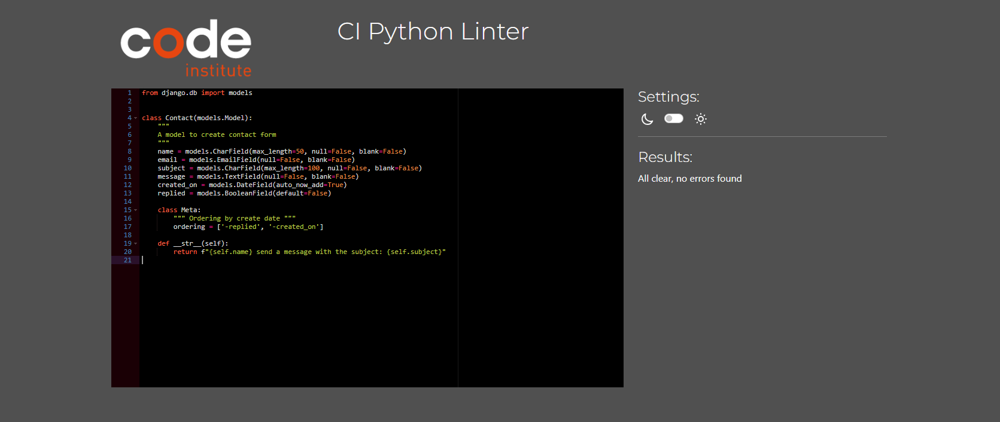
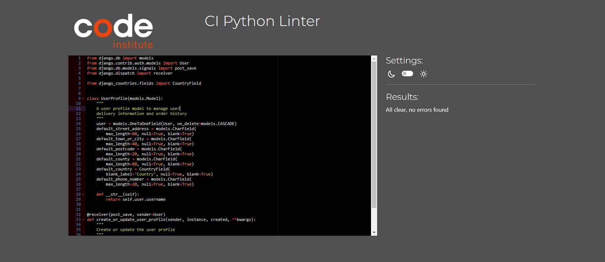
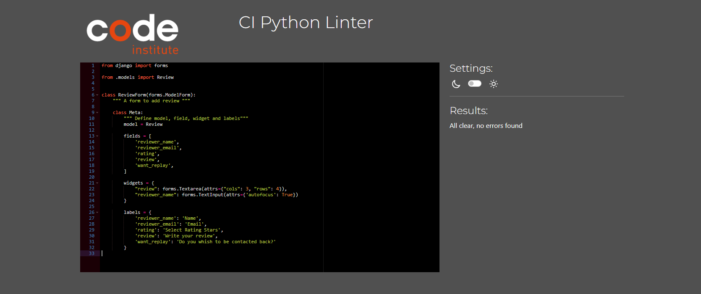
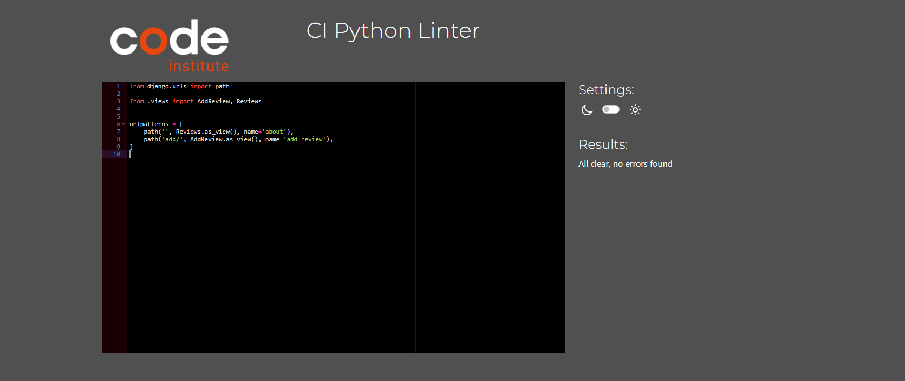
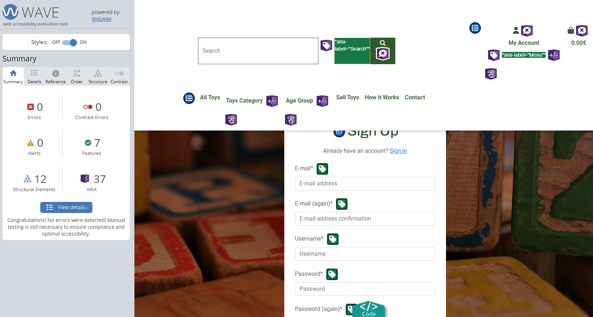

# Testing & Validation 
 
  - [Responsivness Testing](#responsivness-testing)
  - [Browser Compatibility Testing](#browser-compatibility-testing)
  - [User Stories Testing](#user-stories-testing)
  - [Features Testing (Manual Testing)](#feature-testing)
  - [Code Validation](#code-validation)
  - [Lighthouse Testing](#lighthouse)

## Responsiveness Testing
All pages were tested in terms of responsivness to ensure that the conent reacts on various screen size, ranging from 280px up to 1200px. To test the responsiveness the following devices were considered in addition to DevTools.
  - Dell Latitude (DevTool) 
  - Think Pad (DevTool)
  - iPhone 8
  - Samsung Galaxy A52

| ID  | Test Case            | Steps                                                                                                                                                                                                                           | Expected                                                                                                                                                                                                                                                                                                   | Result |
| --- | -------------------- | ------------------------------------------------------------------------------------------------------------------------------------------------------------------------------------------------------------------------------- | ---------------------------------------------------------------------------------------------------------------------------------------------------------------------------------------------------------------------------------------------------------------------------------------------------------- | ------ |
| R1  | Navigation Menu      | Inspect the webpage via DevTools and listed devices and test the responsiveness with different dimensions, look at the navigation menu.                                                                                         | The Navigation Menu outlines all navigation items on large devices and drops into hamburger menu on small devices                                                                                                                                                                                          | PASS   |
| R2  | Footer               | Inspect the webpage via DevTools and listed devices and test the responsiveness with different dimensions, look at the footer.                                                                                                  | The text and icons are displayed properly on large and small devices, always centered                                                                                                                                                                                                                      | PASS   |
| R3  | Hero Section         | Inspect the webpage via DevTools and listed devices and test the responsiveness with different dimensions, look at the text and buttons in hero page                                                                            | The text and buttons are displayed properly on large and small devices, always centered.                                                                                                                                                                                                                   | PASS   |
| R4  | How it works         | Inspect the webpage via DevTools and listed devices and test the responsiveness  with different dimensions, look at the layout of the text                                                                                      | The text should be readable, the text is organized in cards in columns on small devices. On large devices the cards are displayed in row.                                                                                                                                                                  | PASS   |
| R5  | Login                | Inspect the webpage via DevTools and listed devices and test the responsiveness with different dimensions, look at the layout of Login Form with button.                                                                        | The form and button text should be readable. The form width response to the different size of devices                                                                                                                                                                                                      | PASS   |
| R6  | Logout               | Inspect the webpage via DevTools and listed devices and test the responsiveness  with different dimensions, look at the layout of Logout form with buttons.                                                                     | The form and button text should be readable. The form width response to the different size of devices. On small devices, the buttons are organized in a column, while on large in a row                                                                                                                    | PASS   |
| R7  | Register             | Inspect the webpage via DevTools and listed devices and test the responsiveness with different dimensions, look at the layout of Register Form with button.                                                                     | The form and button text should be readable. The form width response to the different size of devices                                                                                                                                                                                                      | PASS   |
| R8  | Toy List             | Inspect the webpage via DevTools and listed devices and test the responsiveness  with different dimensions, look at the layout of toy cards. (Log as Site Owner and focus on button EDIT and DELETE)                            | The toy cards are displayed in column on small devices while in rows on larger devices. The buttons for Site Owner are displayed next to each other. The text is readable on small devices as well                                                                                                         | PASS   |
| R9  | New Toy              | Log as Site Owner. Inspect the webpage via DevTools and listed devices and test the responsiveness  with different dimensions, look at the layout of New Toy Form with button.                                                  | The form and button text should be readable. The form width response to the different size of devices. The button is over the width of form and responsive                                                                                                                                                 | PASS   |
| R10 | Edit Toy             | Log as Site Owner. Inspect the webpage via DevTools and listed devices and test the responsiveness with different dimensions, look at the layout of Edit Toy Form with button.                                                  | The form and button text should be readable. The form width response to the different size of devices. The button is over the width of form and responsive                                                                                                                                                 | PASS   |
| R11 | Delete Toy           | Log as Site Owner. Inspect the webpage via DevTools and listed devices and test the responsiveness with different dimensions, look at the layout of Confirmation Delete Form with two buttons.                                  | The form and button text should be readable. The form width response to the different size of devices. On small devices, the buttons are organized in a row.                                                                                                                                               | PASS   |
| R12 | Detail Toy           | Inspect the webpage via DevTools and listed devices and test the responsiveness with different dimensions, look at the layout of text, image and buttons.                                                                       | The text, image and buttons are displayed properly on both small and large devices. On small devices, the objects are displayed in column. On large devices the image is displayed next to the text and buttons.                                                                                           | PASS   |
| R13 | Search Results       | Search for toy and inspect the webpage via DevTools and listed devices and test the responsiveness with different dimensions, look at the layout of text and buttons.                                                           | All elements are centered                                                                                                                                                                                                                                                                                  | PASS   |
| R14 | Shopping             | Add some toy in shopping bag.  Inspect the webpage via DevTools and listed devices and test the responsiveness with different dimensions, look at the layout of shopping bag content text and with two buttons.                 | All elements are visible and readable for different screen sizes. For small devices, the information in organized in column. For large devices the bag content is on the left side, while delivery form is on the right hand side. The cost information and checkout button are at the right bottom corner | PASS   |
| R15 | Checkout             | Add some toy in shopping bag.  Inspect the webpage via DevTools and listed devices and test the responsiveness with different dimensions, look at the layout of shopping bag content, delivery form, text and with two buttons. | All elements are visible and readable for different screen sizes. For small devices, the information in organized in column. For large devices the bag content is on the left side, while delivery form is on the right hand side. The cost information and checkout button are at the right bottom corner | PASS   |
| R16 | Checkout - Thank you | Make a purchase and click on Complete Order. Inspect the webpage via DevTools and listed devices and test the responsiveness with different dimensions, look at the layout of Thank you page content.                           | The content is readable and visible on different devices. For small devices, the text and button are centered. While on large devices, the order summary and delivery information is organized into two columns                                                                                            | PASS   |
| R17 | Profile              | Log in and continue to My profile. Inspect the webpage via DevTools and listed devices and test the responsiveness with different dimensions, look at the layout of My profile content text, tables, form and button.           | All elements are visible and readable for different devices. For small screen sizes, the content is center. While on large screen sizes, the order and sell history is on the left side and the form is located on the right side.                                                                         | PASS   |
| R18 | Contact              | Click on Contact in Navigation Menu and  inspect the webpage via DevTools and listed devices and test the responsiveness with different dimensions, look at the layout of contact form with button.                             | The form is center and visible on all different devices                                                                                                                                                                                                                                                    | PASS   |
| R19 | Privacy Policy       | Click on Privacy Policy link in footer. Inspect the webpage via DevTools and listed devices. Test the side for responsiveness and look at the layout.                                                                           | The content of the Privacy Policy is readable on all listed devices                                                                                                                                                                                                                                        | PASS   |
| R20 | Terms & Conditions   | Click on Terms & Conditions link in footer. Inspect the webpage via DevTools and listed devices. Test the side for responsiveness and look at the layout.                                                                       | The content of the Terms & Conditions is readable on all listed devices                                                                                                                                                                                                                                    | PASS   |
| R21 | Return & Refund      | Click on Return & Refund link in footer. Inspect the webpage via DevTools and listed devices. Test the side for responsiveness and look at the layout.                                                                          | The content of the Return & Refund is readable on all listed devices                                                                                                                                                                                                                                       | PASS   |
| R22 | Hidden Pages         | Extend the url and add /test in the end. Inspect the webpage via DevTools and listed devices. Test the side for responsiveness and look at the layout of the hidden pages                                                       | The content of the Hidden Pages  is readable and fully displayed                                                                                                                                                                                                                                           | PASS   |
| R23 | About Page         | Go to About in Navigation Menu. Inspect the webpage via DevTools and listed devices. Test the side for responsiveness and look at the layout of text, image, button and review boxes.                                                       | The content of the page is center and displayed in a column on small devices. On large, the picture is shown next to the text. The boxes are in rows.                                                                                                                                                                                                                                           | PASS   |
| R24 | Add Review Page         | Go to About in Navigation Menu and click on Send Review. Inspect the webpage via DevTools and listed devices. Test the side for responsiveness and look the review form                                                       | The form is centered and readable on all devices.                                                                                                                                                                                                                                           | PASS   |
| R25 | Sell Toy Page         | Login. Go to Sell Toy in Navigation Menu. Inspect the webpage via DevTools and listed devices. Test the side for responsiveness and look the form                                                       | The form is centered and readable on all devices.                                                                                                                                                                                                                                           | PASS   |
| R26 | Sell History - Statu Page         | Login. Go to My Profile. Click on an item in selling history.  Inspect the webpage via DevTools and listed devices. Test the side for responsiveness and look the image and text                                                      | On small devices, the content is centered in a column. On large devices, the text and image are displayed next to each other.                                                                                                                                                                                                                                          | PASS   |

[Back to the content](#testing--validation)

## Browser Compatibility Testing
The website was tested on different browser (see the list below) to assure that features and responsiveness work accordingly.
- Safari tested on iPhone without any problems.
- Chrome tested on iPhone, Dell Latitute and ThinkPad without any problems.
- Edge test on Dell Latitude without any issues.
- Mozila Firefox tested on ThinkPad without any troubles but on Samsung A52 some issues discovered. Colors and white color background are not displayed. This will be solved in next iterations.

## User Stories Testing
The testing was grouped according to the epics to which user story belongs.

| US ID                          | AS A/AN       | I WANT TO BE ABLE TO ..                                            | SO THAT I CAN                                                                                                     | ACCEPTANCE CRITERIA                                                                                                                                                                                                                                                   | RESULT |
| ------------------------------ | ------------- | ------------------------------------------------------------------ | ----------------------------------------------------------------------------------------------------------------- | --------------------------------------------------------------------------------------------------------------------------------------------------------------------------------------------------------------------------------------------------------------------- | ------ |
| Preparation & Deployment       |               |                                                                    |                                                                                                                   |
| #1                             | Developer     | Prepare wireframe and plan the development of the e-shop           | smoothly develop the web page                                                                                     | wireframes for mobile and desktop are created user stories are planned (acceptance criteria, tasks, MOSCOW) colors and fonts are chosen toys images are created                                                                                              | PASS   |
| #2                             | Developer     | Document the webpage and the development                           | provide transparent solution who everybody can follow                                                             | readme file is created, including all chapters                                                                                                                                                                                                                     | PASS   |
| #3                             | Developer     | Test and validate my web page                                      | guarantee full functionality and development according to the best practice                                       | web page is validated web page is manually tested                                                                                                                                                                                                                  | PASS   |
| #4                             | Developer     | Deploy the page                                                    | guarantee that the web page is accessible to everyone                                                             | deployed on heroku media and statics are on 3s                                                                                                                                                                                                                     | PASS   |
| Viewing and Navigation         |               |                                                                    |                                                                                                                   |
| #5                             | First Visitor | quickly see what the web-page offers                               | easily purchase or sell toys                                                                                      |  landing page is created with two buttons (shop now, sell toy)  header is created with logo and navigation menu  footer is created with social media links  how it works is created                                                                          | PASS   |
| #36                            | Site Users    | come back to home page in case usual request are made              | continue purchasing                                                                                               | hidden page 404 is created hidden page 403 is created hidden page 500 is created                                                                                                                                                                                | PASS   |
| #9                             | Shopper       | view a list of toys                                                | see the whole e-shop offer and select some to buy                                                                 |  in navigation menu there is item to see all products  on the landing page there is a button to go to all product  each toy is on the web page represented by ist image  some information is provided  only toys with status for e-shop are displayed  | PASS   |
| #10                            | Shopper       | view individual toys details                                       | find the price, description, product image and quality                                                            | each product is clickable product detail page contains more information buttons to put in shopping bag or go back for site users buttons to edit and remove for site owners                                                                                  | PASS   |
| #11                            | Shopper       | Quickly identify toys according to age group                       | easily find the toys for my children                                                                              |  there is a menu item age group with age groups  there are toys categories in the menu dropdown item for all toys  the menu item redirects to the corresponding group                                                                                           | PASS   |
| #40                            | User          | the possibility to write the site owner                            | contact him/her in any matter                                                                                     |  contact app is created  contact form is created  thank you page is shown after sending the contact form                                                                                                                                                     | PASS   |
| #12                            | Shopper       | quickly see the total of my purchases at any time                  | avoid spending too much time                                                                                      |  total cost icon are in the header  correct total cost is displayed                                                                                                                                                                                                | PASS   |
| Registration and User Accounts |               |                                                                    |                                                                                                                   |
| #13                            | Site User     | Easily register                                                    | Have a personal account                                                                                           | allauth app is created and setup  there is a register page  there are buttons and menu item for register                                                                                                                                                        | PASS   |
| #14                            | Site User     | Easily login or logout                                             | Access my account                                                                                                 |  there are pages to login and logout page  there are buttons and links to do so                                                                                                                                                                                    | PASS   |
| #15                            | Site User     | Easily recover my password in case I forget it                     | Recover access to my account                                                                                      | there is a link to recover password there is a page to do so                                                                                                                                                                                                       | PASS   |
| #16                            | Site User     | Receive an email confirmation after registering                    | Verify that my account registration was successful                                                                | there is a page which informs user about confirmation user receives email with the corresponding text                                                                                                                                                              | PASS   |
| #17                            | Site User     | Have a personalized user profile                                   | View and update my personal information                                                                           | there is  a page with personal detail which I can update only authorized user can view and update the personal information                                                                                                                                         | PASS   |
| #24                            | Shopper       | have the possibility to save my delivery information when checkout | do not have to fill the information several times                                                                 | there is a check-box to save the information on the checkout page there is a logic which works                                                                                                                                                                     | PASS   |
| Sorting and Searching          |               |                                                                    |                                                                                                                   |                                                                                                                                                                                                                                                                       |
| #18                             | Shopper       | Sort the list of available toys                                    | Easily identify the best priced toys, toys in the best quality and alphabetically sorted toys                     | the item in navigation menu works properly: by price, by quality, by category, by name                                                                                                                                                                                | NOT IMPLEMENTED - in a next iteration   |
| #19                             | Shopper       | Sort a specific and multiple category of products                  | Find the best priced or best quality product in a specific category or sort the products in that category by name | there is dropdown to sort the toys accordingly the fully functional logic has been created                                                                                                                                                                         | NOT IMPLEMENTED - in a next iteration   |
| #20                            | Shopper       | Filter for specific toys categories                                | find easily what I search for                                                                                     |  there are toys categories in navigation menu  the fully functional logic has been created  toy categories are displayed in the search bar                                                                                                                      | PASS   |
| #21                            | Shopper       | search for a product by name or description                        | find a specific product I would like to purchase                                                                  | there is a fully functional search input field there is information on what have been searched/filtered for and number of results                                                                                                                                  | PASS   |
| Purchasing and Checkout        |               |                                                                    |                                                                                                                   |
| #22                            | Shopper       | easily add/delete a toy when purchasing it                         | ensure that I select the correct product                                                                          |  each toy page has button add  there is a button to delete a toy from shopping bag that works  there is a toast after each addition into shopping bag                                                                                                           | PASS   |
| #23                            | Shopper       | view items in my bag to purchased                                  | identify the total cost of my purchase and all items I will receive                                               | there is the app bag there is shopping bag page there are all listed toys to purchase there is detail information about total cost                                                                                                                           | PASS   |
| #25                            | Shopper       | Easily enter my payment information                                | Checkout quickly and with no hassies                                                                              | the app was created the checkout page was created there is a order overview there is a form to fill delivery and payment information                                                                                                                      | PASS   |
| #26                            | Shopper       | Feel my personal and payment information is safe and secure        | Confidently provide the needed   information to make a purchase                                                   |  stripe was setup on dev and prod  webhook was setup on dev and prod  the stripe and webhook credentials are hidden  payment input field is on checkout page                                                                                                 | PASS   |
| #27                            | Shopper       | View an order confirmation after checkout                          | Verify that I have not made any mistakes                                                                          |  there is a order confirmation page after checkout  page contains order summary and delivery with billing info  there is a button to return to Homepage                                                                                                      | PASS   |
| #29                            | Shopper       | View shopping history                                              | see what I have purchase so far                                                                                   | in personal profile there is shopping history overview each order can be view in details users can access only their order history                                                                                                                              | PASS   |
| #28                            | Shopper       | Receive an email confirmation after checking out                   | Keep the confirmation of what I have purchased for my records                                                     | shopper gets confirmation email                                                                                                                                                                                                                                       | PASS   |
| Selling                        |               |                                                                    |                                                                                                                   |                                                                                                                                                                                                                                                                       |        |
| #30                            | Seller        | provide all information abou toys                                  | easily sell toys                                                                                                  | there is a page with the  form to sell a toy the page includes instructions as well                                                                                                                                                                                | PASS   |
| #32                               | Seller        | request money                                                      | get money from the sold toy                                                                                       | there is a button to request money if the toy is sold
  after request an confirmation is shown                                                                                                                                                                                                                                                                      | PASS - the request is done via email with the prefilled email and toy number   |
| #31                             | Seller        | have all the sell in my user profile                               | view sell history and the status of each sell                                                                     | there is a sell history in the profile each sell can be viewed additionally                                                                                                                                                                                        | PASS   |
| Admin and Store Management     |               |                                                                    |                                                                                                                   |
| #33                            | Store Owner   | add a toy                                                          | add new items to my store                                                                                         |  the app products/toys is setup  there is a page with form to add a new toy  the page is visible only for store owner                                                                                                                                           | PASS   |
| #34                            | Store Owner   | edit/update toy details                                            | change toy prices, descriptions, images and other product criteria, including toy status                          | there is a page with the form to edit existing toys there is a field to change the status - visible only for store owner there is a link for each to to edit the information the page can access only Site Owner                                             | PASS   |
|                                | Store Owner   | Ensure that only approved toys are display                         |                                                                                                                   |                                                                                                                                                                                                                                                                       | PASS   |
| #35                            | Store Owner   | delete a toy                                                       | remove toys that are no longer for sale                                                                           | there is a way to delete toys from e-shop there is a link to delete the to only Site Owner can do that                                                                                                                                                          | PASS   |
| SEO & Marketing                |               |                                                                    |                                                                                                                   |                                                                                                                                                                                                                                                                       |
| #6                             | Site User     | read about Delivery & Refunds                                      | to know what to except when requesting refund and what are delivery costs                                         | Delivery & Refund Information is created                                                                                                                                                                                                                              | PASS   |
| #7                             | Site User     | read about privacy policy                                          | know which information are being used                                                                             | privacy policy is created                                                                                                                                                                                                                                             | PASS   |
| #8                             | Store Owner   | inform site users about news from e-shop                           | increase the change to purchase toys                                                                              | newsletter is created                                                                                                                                                                                                                                                 | PASS   |
| #37                            | Store Owner   | implement some SEO techniques                                      | increase the chance to purchase on my e-shop                                                                      | meta tags are fill out sitemap is created robots.txt is created                                                                                                                                                                                                 | PASS   |
| #38                            | Site User     | see favicon in the browser tab                                     | easily find the e-shop                                                                                            | favicon is created favicon is included                                                                                                                                                                                                                             | PASS   |
| #39                            | Site User     | read about Terms & Conditions                                      | know what to except when selling the toys                                                                         | Terms & Conditions are created                                                                                                                                                                                                                                        | PASS   |
| #41                            | Site User     | have the possibility to provide review                                      | support and make the e-shop more reliable                                                                         |  review app is set up form to provide review is created page with all proved reviews is displayed createdcreated                                                                                                                                                                                                                                        | PASS   |

[Back to the content](#testing--validation-report)

## Features Testing
The features testing was also conducted group-wise. The outcome and testing steps are described bellow in detail.

| ID  | Test Case                                 | Steps                                                                                                                                                                                                     | Expected                                                                                                                                                                                                                                                                                               | Result |
| --- | ----------------------------------------- | --------------------------------------------------------------------------------------------------------------------------------------------------------------------------------------------------------- | ------------------------------------------------------------------------------------------------------------------------------------------------------------------------------------------------------------------------------------------------------------------------------------------------------ | ------ |
| F1  | Navigation Items                          | Go to My Profile > Click on Register Go to My Account > Click on Login Login > Go to My Profile > Click on Logout Go to How it Works Go to Toys Category > All Products  Go to My Profile   Go to About   Go to Contact            | Form to register is displayed Form to Login is displayed Question to Logout or Stay is displayed User is redirected to How It Works Page User is redirected to page with all toys User is redirected to My Profile Page   About Page is displayed  Contact Form is displayed                                                                | PASS   |
| F2  | Navigation Items Hover effect             | Go each item in navigation menu and check the hove effect                                                                                                                                                 | Each item should change the font weight to bold                                                                                                                                                                                                                                                        | PASS   |
| F3  | Footer - Social Links                     | Go to Footer Click on Facebook Icon Click on Instagram Icon Click on Email Icon                                                                                                                  | The corresponding social media platform is open in a new tab. The Email Editor is open to contact e-shop.                                                                                                                                                                                           | PASS   |
| F4  | Footer - Polices & Terms                  | Go to Footer Click on Privacy Policy Click on Return & Refund Click on Terms & Conditions                                                                                                        | The user is redirected to the corresponding page.                                                                                                                                                                                                                                                      | PASS   |
| F5  | Register                                  | Go to My Account Click on Register Register with test user Confirm the registration in email                                                                                                     | Toast message is displayed to inform about registering and sending email Email to confirm registration is received.                                                                                                                                                                                 |        |
| F6  | Log in                                    | Go to My Profile Click on Log In Log in with test user                                                                                                                                              | Test user is logged in and the user name is displayed unter the user icon. Toast message about logging in is displayed                                                                                                                                                                              | PASS   |
| F7  | Log out                                   | Login with test user Go to My Account > Click on Log Out Click on Stay Button Go to My Account > Click on Logout Click on Logout Button                                                       | Question is display whether to stay or log out When clicked on Stay, user is redirected to the homepage When clicked on Log out, user is logged out Toast message informarming about logging out is displayed.                                                                                | PASS   |
| F8  | Reset Password                            | Go to My Account > Login > Forget my password Enter the email address Wait for email > Click on Link to change password Enter new password                                                       | Email with the link to reset password is received After entering a new password and message is shown that the password was reset.                                                                                                                                                                   | PASS   |
| F9  |  Add Toy - Required field                 | Go to My Account Log in as Site Owner Click on My Account > Add New Toy Fill out form leaving on required field empty                                                                            | User is redirected to the New Toy form. User is ask to fill out the required form.                                                                                                                                                                                                                  | PASS   |
| F10 | Add Toy                                   | Continue from previous Fill out form correctly                                                                                                                                                         | User is redirected to the Toys Page. Toast message is displayed                                                                                                                                                                                                                                     | PASS   |
| F11 | Edit Toy - Button                         | Go to My Account Log in as Site Owner Go to the Toys Page Click on Edit in one of the toys                                                                                                       | User is redirected to the Edit Toy form                                                                                                                                                                                                                                                                | PASS   |
| F12 | Edit Toy                                  | Continue from previous Update one of the form field.                                                                                                                                                   | User is redirected to the Toys Page. Toast message is displayed.                                                                                                                                                                                                                                    | PASS   |
| F13 | Delete Toy - Button                       | Go to My Account Log in as Site Owner Go to the Toys Page Click on Delete in one of the toys                                                                                                     | User is redirected to the Delete Toy Question with two Buttons                                                                                                                                                                                                                                         | PASS   |
| F14 | Delete Toy - Back                         | Continue form previous Click on Back                                                                                                                                                                   | User is redirected to the Toys Page                                                                                                                                                                                                                                                                    | PASS   |
| F15 | Delete Toy - Delete                       | Continue from 'Delete Toy - Button Click on Delete                                                                                                                                                     | Toy is deleted User is redirected to the Toys Page. Toast message is displayed                                                                                                                                                                                                                   | PASS   |
| F16 | Search - Name                             | Click on Search Input Field Search for Train Click on Clear Search                                                                                                                                  | Results for train should be displayed the number of search results is displayed Button to clear Search is displayed User is redirected to all toys and the button disappears                                                                                                                  | PASS   |
| F17 | Search - Description                      | Click on Search Input Field Search for Play Click on Clear Search                                                                                                                                   | Results for train should be displayed the number of search results is displayed Button to clear Search is displayed User is redirected to all toys and the button disappears                                                                                                                  | PASS   |
| F18 | Filter - Toy Category                     | Click on Toy Category Select one toy category Click on one subcategory                                                                                                                              | The number of toys corresponding to the category and toys are displayed The subcategories of the category are show The number of toys and target toys are displayed                                                                                                                           | PASS   |
| F19 | Filter - Age Group                        | Click on Age Group Select one age group Click on one subcategory if present                                                                                                                         | The number of toys corresponding to the age group and toys are displayed The subcategories of the age group are show The number of toys and target toys are displayed                                                                                                                         | PASS   |
| F20 | Shopping Bag - Icon                       | Add some toys into shopping bag Look at the bag icon in navigation menu                                                                                                                                | The icon is colored differently There is total cost of shopping bag below the icon Toast message with the bag content and checkout button is displayed                                                                                                                                           | PASS   |
| F21 | Shopping Bag                              | Continue from the previous Click on bag icon in navigation menu                                                                                                                                        | There is a list of inserted toys with corresponding prices Information about cost is displayed Two buttons Back and Checkout are shown                                                                                                                                                           | PASS   |
| F22 | Shopping Bag - Delete                     | Continue from the previous Click on the Trash button next to one of the inserted toy                                                                                                                   | The toy is removed from the shopping bag User is informed in toast message about the action                                                                                                                                                                                                         | PASS   |
| F23 | Shopping Bag - Back                       | Continue form the previous Shopping Bag Click on Back Button                                                                                                                                           | User is redirected to the page with all toys                                                                                                                                                                                                                                                           | PASS   |
| F24 | Shopping Bag - Checkout                   | Continue from the previous Shopping Bag Leave the Check Box Save Delivery info checked Click on Checkout Button                                                                                     | User is redirected to the Checkout page                                                                                                                                                                                                                                                                | PASS   |
| F25 | Checkout - Form                           | Continue from the previous Shopping Bag - Checkout Fill out the form but leave one required field empty Click on Complete Order                                                                     | User is informed about not filled out field that is required                                                                                                                                                                                                                                           | PASS   |
| F26 | Checkout - Complete                       | Continue from the previous Shopping Bag - Checkout Fill out the form correctly, with the bank details 4242 4242 4242 4242 Click on Complete Order                                                   | User is redirected on the Thank you page with the order summary. User is informed by toast message about the success.                                                                                                                                                                               | PASS   |
| F27 | Checkout - Authentication ( Failed)       | Continue from the previous Shopping Bag - Checkout Fill out the form with the bank details: 4000 0025 0000 3155 Click on Complete Order Authenticate                                             | Authentication Page is shown. User is redirected to the Checkout page.                                                                                                                                                                                                                              | PASS   |
| F28 | Checkout - Authentication (Complete)      | Continue from the previous Shopping Bag - Checkout Fill out the form with the bank details: 4000 0025 0000 3155 Click on Complete Order Cancel                                                   | Authentication Page is displayed. User is redirected on the Thank you page with the order summary. User is informed by toast message about the success.                                                                                                                                          | PASS   |
| F29 | Checkout - Save Delivery Info (checked)   | Continue from the previous Shopping Bag - Checkout Go to My Account > My Profile                                                                                                                       | The delivery info is saved                                                                                                                                                                                                                                                                             | PASS   |
| F30 | Checkout - Save Delivery Info (unchecked) | Continue from the previous Shopping Bag Give different delivery information Unchecked the Check Box to Save Delivery Information Go to My Account > My Profile                                   | The delivery info did not changed from the previously inserted.                                                                                                                                                                                                                                        | PASS   |
| F31 | Webhook - Succeed                         | Add some toys into shopping bag and fill out checkout with test card Go to Stripe > Developers > Webhooks Check the status and response of the event                                                | User is redirected to the Checkout Thank you Page containing delivery and billing info Toast message informs user about completing the order and sending confirmation email Email is received with the order details Webooh dashboard: Response - SUCCESS: Verified order already in database | PASS   |
| F32 | Webhook - Form is not sended              | Comment form.submit() in stripe_elemetns.js Add some toys into shopping bag and fill out checkout with test card Go to Stripe > Developers > Webhooks Check the status and response of the event | the loading spinner should stay Webooh dashboard: Response - SUCCESS: Created order in webhook The profile is attached                                                                                                                                                                           | PASS   |
| F33 | Profile - Order                           | Go to My Account > Login Go to My Profile > Click on a order listed in Order History                                                                                                                   | User is redirected to the Order Details Page                                                                                                                                                                                                                                                           | PASS   |
| F34 | Profile - See older orders                | Go to My Account > Login Go to My Profile > Click on a order listed in See older orders                                                                                                                | User is redirected to the Order History Page                                                                                                                                                                                                                                                           | PASS   |
| F35 | Profile - Sell                            | Go to My Account > Login Go to My Profile > Click on a order listed in Sell History                                                                                                                    | User is redirected to the Sell Details Page                                                                                                                                                                                                                                                            | PASS   |
| F36 | Profile - See older sells                 | Go to My Account > Login Go to My Profile > Click on a order listed in See older sells                                                                                                                 | User is redirected to the Sell History Page                                                                                                                                                                                                                                                            | PASS   |
| F37 | Profile - Form                            | Go to My Account > Login Go to My Profile > Fill out the Form Click on Save Information Button                                                                                                      | The filled out information are saved/updated in the form. User is informed via toast message about the updated profile information                                                                                                                                                                  | PASS   |
| F38 | Contact                                   | Click on Contact in navigation Menu Fill out the form Click on Send                                                                                                                                 | The thank you page is displayed with the home button                                                                                                                                                                                                                                                   | PASS   |
| F39 | Contact - Missing field                   | Click on Contact in navigation Menu Fill out the form but leaving one empty field Click on Send button                                                                                              | User is informed about not filled out field that is required                                                                                                                                                                                                                                           | PASS   |
| F40 | Thank You Page                            | Continue from Contact Click on Home Button                                                                                                                                                             | User is redirected to the landing page                                                                                                                                                                                                                                                                 | PASS   |
| F41 | Newsletter                                | Scroll down to footer on any but landing page Fill out email for subscription                                                                                                                          | Message is show that email was saved for subscription                                                                                                                                                                                                                                                  | PASS   |
| F42 | Hidden Page - 404                         | Extend the url and add /test in the end                                                                                                                                                                   | 404 Page is shown                                                                                                                                                                                                                                                                                      | PASS   |
| F43 | Hidden Page - 403                         | Login as admin Extend the url and add /toys/add                                                                                                                                                        | 403 Page is shon                                                                                                                                                                                                                                                                                       | PASS   |
| F46 | About Page                         | Click on About in Navigation Menu Continue by clicking on Provide Review                                                                                                                                                         | Page about is displayed There are reviews on the page User is redirected to the Review Form                                                                                                                                                                                                                                                                                       | PASS   |
| F47 | About Page - Review                        | Continue from the previous About Page Fill out the Form Send the review form Review                                                                                                                                                         | Review form is send and user is informed about it by the message tost.                                                                                                                                                                                                                                                                                        | PASS   |
| F48 | Sell Page - Link Information                        | Go to Sell Toy Click on link Information in the text                                                                                                                                                          | User is redirected on How it works page                                                                                                                                                                                                                                                                                       | PASS   |
| F49 | Sell Page - Form                        | Login Go to Sell Toy Fill out the Form Send the toy to be approved for eshop                                                                                                                                                          | The form is send and user is informed by the toys  Use is redirected on landing page                                                                                                                                                                                                                                                                                       | PASS   |
| F50 | Sell Page - Toy Status                        | Continue from the previous Sell Page-Form Go to your Profile Page Click on one item in Selling History                                                                                                                                                           | A Page with a status of you sell request is shown.                                                                                                                                                                                                                                                                                      | PASS   |

[Back to the content](#testing--validation)

### Testing Webhooks using Stripe CLI
- Follow [official documentation](https://docs.stripe.com/stripe-cli) to setup Stripe CLI.
- Open PowerShell and use command `stripe login` to log in to your stripe account.
- To forward events to your webhook, type `stripe listen --forward to localhost:4242/webhook`
- Test different type of events, e.g. using `stripe trigger payment_intent.succeeded`, more type events can be found [here](https://dashboard.stripe.com/test/webhooks/create?endpoint_location=local). 

**Report**
The Webhook was tested on development environment. Two type of events were tested: `payment_intent.succeeded` and `payment_intent.payment_failed`. The outcome of testing is listed below
  - `payment_intent.payment_failed`: [terminal](./docs/testing/wh/wh_payment_failed_terminal.PNG), [dashboard](./docs/testing/wh/wh_payment_failed_dashboard.PNG)
  - `payment_intent.succeeded` : [terminal](./docs/testing/wh/wh_payment_successed_terminal.PNG), [dashboard](./docs/testing/wh/wh_payment_successed_dashboard.PNG), [cache data](./docs/testing/wh/cacha_data.PNG)

There were additional webhook test performed, see the report of Features Testing 

## Code Validation
The webpage was validated from several perspectives:
- the markup validity, see [HTML](#html).
- the css properties, see [CSS](#css).
- the web accessibility, see [Accessibility](#accessibility).
- the coding rules of the JavaScript source code, see [JavaScript](#javascript).
- the coding rules of Python source code, see [Python](#pep8).
- the more general quality of the webpage, see [Lighthouse](#lighthouse)

### HTML 
The [Nu Html Checker](https://validator.w3.org/nu/) web-based tool by W3 was used to validate the pages of the webpage. The source code of pages was checked directly via text input or  via provided page URL. The validation detected several errors in the snippet code for the newsletter subscribtion. This code was copied directly from [mailchimp](https://us14.admin.mailchimp.com/). The below detailed reports ignore the [errors from mailchimp tool](./docs/testing/html/html_newsletter.PNG):

| Page Group | Page | Report | Results |
|------------|------|--------|---------|
| Viewing & Navigation | Landing Page | [On-line Report](https://validator.w3.org/nu/?doc=https%3A%2F%2Floopitoy-2943fdc3b2bc.herokuapp.com%2F) | no errors |
|  | How it Works| [On-line Report](https://validator.w3.org/nu/?doc=https%3A%2F%2Floopitoy-2943fdc3b2bc.herokuapp.com%2Fhow-it-works) | no errors |
|  | Contact | [Online Report](https://validator.w3.org/nu/?doc=https%3A%2F%2Floopitoy-2943fdc3b2bc.herokuapp.com%2Fcontact%2F) | no errors |
| Toys | Toys Overview | [On-line Report](https://validator.w3.org/nu/?doc=https%3A%2F%2Floopitoy-2943fdc3b2bc.herokuapp.com%2Ftoys%2F) | no errors|
|  | Toy Detail | [On-line Report](https://validator.w3.org/nu/?doc=https%3A%2F%2Floopitoy-2943fdc3b2bc.herokuapp.com%2Ftoys%2Fdetail%2F6%2F) | no errors|
|  | Toy Filter | [On-line Report](https://validator.w3.org/nu/?doc=https%3A%2F%2Floopitoy-2943fdc3b2bc.herokuapp.com%2Ftoys%2F%3Fcategory%3Dfine_motor%2Cgross_motor) | no errors|
| | Toy Search | [On-line Report](https://validator.w3.org/nu/?doc=https%3A%2F%2Floopitoy-2943fdc3b2bc.herokuapp.com%2Ftoys%2F%3Fq%3Dwood) | no errors|
| Account | Log In | [On-line Report](https://loopitoy-2943fdc3b2bc.herokuapp.com/accounts/login/) | no erros |
|  | Log Out | [On-line Report](https://validator.w3.org/nu/?doc=https%3A%2F%2Floopitoy-2943fdc3b2bc.herokuapp.com%2Faccounts%2Flogout%2F) | no errors |
|  | Sign Up | [On-line Report](https://loopitoy-2943fdc3b2bc.herokuapp.com/accounts/signup/) | no erros 
| Admin & Site Owner | Add Toy | [Report](./docs/testing/html/html_admin_add_toy.PNG) | no erros |
| | Edit Toy | [Report](./docs/testing/html/html_admin_edit_toy.PNG) | no erros |
| | Delete Toy | [Report](./docs/testing/html/html_admin_delete_toy.PNG) | no erros |
| Purchasing & Checkout| Shopping Bag | [Report](./docs/testing/html/html_bag.PNG) | no erros |
| | Checkout | [Report](./docs/testing/html/html_checkout.PNG) | no erros |
| | Checkout - Thank you| [Report](./docs/testing/html/html_checkout_thank_you.PNG) | no erros |
| | Profile | [Report](./docs/testing/html/html_profile.PNG) | no erros |
| Polices | Privacy Policy | [Online-Report](https://validator.w3.org/nu/?doc=https%3A%2F%2Floopitoy-2943fdc3b2bc.herokuapp.com%2Fprivacy-policy)| no errors |
| | Return & Refund | [On-line Report](https://validator.w3.org/nu/?doc=https%3A%2F%2Floopitoy-2943fdc3b2bc.herokuapp.com%2Freturn-and-refund) | no errors |
| | Terms & Conditions | [On-line Report](https://validator.w3.org/nu/?doc=https%3A%2F%2Floopitoy-2943fdc3b2bc.herokuapp.com%2Fterms-and-conditions) | no errors |
| Review | Add Review Page | [Report](./docs/testing/html/html_review_add.PNG)| no errors |
|  | About & Review Page | [Report](./docs/testing/html/html_review_about.PNG)| no errors |
|  Contact | Contact Us Page | [Report](./docs/testing/html/html_contact.PNG)| no errors |
|  Sell | Sell Toy Page | [Report](./docs/testing/html/html_sell.PNG)| no errors |
|  | Sell History - Status | [Report](./docs/testing/html/html_sell_history.PNG)| no errors |

[Back to the content](#testing--validation)

### Javascript
The [JShint](https://jshint.com/) static tool was considered to check the code rules of the JavaScript source code.

| JS File | Report | Results   |
|----------|--------|-----------|
| `checkout/static/checkout/js/stripe_elements.js` |  | undefined variable Stripe - this is a function from stripe  |
| `profiles/static/profiles/js/countryfield.js` |  | no error |

### CSS
The [jigsaw](https://jigsaw.w3.org/css-validator/) web-based tool by W3 was used to validate the CSS of the webpage. The conent of `base.css` and `checkout.css` was directly insertet on [the webpage](https://jigsaw.w3.org/css-validator/#validate_by_input). The CSS Validator did not detect any erros, see reports bellow.

| CSS File | Report | Results   |
|----------|--------|-----------|
| `base.css` |  | no error |
| `checkout.css` |  | no error |
| `profile.css` |  | no error |

### PEP8
To validate the Python code in terms of PEP8, the [CI Python Linter](https://pep8ci.herokuapp.com/#) was used.

| Module | Python file               | Report | Results   |
|--------|---------------------------|--------|-----------|
|`bag` | `apps.py`          |  | no error |
| | `contexts.py`          |  | no error |
|  | `urls.py`          |  | no error |
| | `views.py`          |  | no error |
|`checkout` | `admin.py`          |  | no error |
| | `apps.py`          |  | no error |
| | `forms.py`          |  | no error |
| | `models.py`          |  | no error |
| | `signals.py`          |  | no error |
|  | `urls.py`          |  | no error |
| | `views.py`          |  | no error |
| | `webhook_handler.py`          |  | no error |
| | `webhooks.py`          |  | no error |
|`contact` | `admin.py`          |  | no error |
| | `forms.py`          |  | no error |
| | `models.py`          |  | no error |
|  | `urls.py`          |  | no error |
| | `views.py`          |  | no error |
| `home` | `urls.py`          |  | no error |
| | `views.py`          |  | no error |
| `loopitoy` | `settings.py` |  | no error |
| | `urls.py`          |  | no error |
| | `views.py`          |  | no error |
| `profiles` | `forms.py` |  | no error |
| | `models.py`          |  | no error |
| | `urls.py`          |  | no error |
| | `views.py`          |  | no error |
| `toys` | `admin.py` |  | no error |
|  | `forms.py` |  | no error |
| | `models.py`          |  | no error |
| | `urls.py`          |  | no error |
| | `views.py`          |  | no error |
| `review` | `admin.py` |  | no error |
|  | `forms.py` |  | no error |
| | `models.py`          |  | no error |
| | `urls.py`          |  | no error |
| | `views.py`          |  | no error |

[Back to the content](#testing--validation)

### Accessibility
The chrome extension [WAVE Evaluation Tool](https://chromewebstore.google.com/detail/wave-evaluation-tool/jbbplnpkjmmeebjpijfedlgcdilocofh) was considered for the evaluation of the web accessibility. The validation revealed missing `arial-label` attributes in profile and checkout form. These were added. The final detailed reports are below:

| Category | Page Report | Results |
|----------|-------------|---------|
| Info Pages | Landing Page         |  | no error |
|  | How It Works Page         |  | no error |
|  | Contact Page         |  | no error |
|  | Hidden Page         |  | no error |
|  | Polices Page         |  | no error |
| Account Pages | Register Page         |  | no error |
|  | Log In Page         |  | no error |
|  | Log In Page         |  | no error |
|  | Profile Page         |  | no error |
| Shopping Pages | Shopping Bag Page         |  | no error |
|  | Checkout Page         |  | no error |
|  | Checkout Completed Page         |  | no error |
| Toy Pages | Add Toy Page         |  | no error |
|  | Edit Toy  Page         |  | no error |
|  | Delete Toy  Page         |  | no error |
|  | Detail Toy  Page         |  | no error |
|  | Toys Overview  Page         |  | no error |
| Review Pages | Add Review Page         |  | no error |
|  | About & Review Page         |  | no error |
| Contact Pages  | Contact Us Page         |  | no error |
|  Sell Pages| Sell Toy Page         |  | no error |
|   | Sell History - Status Page         |  | no error |

[Back to the content](#testing--validation)

## Lighthouse
The Lighthouse in Chrome DevTools evaluates the webpage for performance, accessibility, best practices, and SEO. The pages with the main content were evaluated, meaning the pages with forms were not considered as they are produce mainly form The evaluation did not reveal any big issues. The detailed reports can be viewed at:

| Page            | Desktop | Mobile | 
|-------------------|--------|------------------|
| Home |  |  |

[Back to the content](#testing--validation-report)